# 09. 애니메이션 / 상태 다이어그램 — 안시성: 88일의 약속

> Phase 2 - 디자인 파트 산출물 #3
> 작성: 디자인 리더
> 작성일: 2026-05-17
> 인풋: `docs/03_game_design_document.md` (§3 영웅, §4 아군, §5 적, §9.5 이펙트), `docs/04_technical_architecture.md` (§2.1 Canvas 한계, §4.2 entity 모듈), `docs/07_wireframes_visuals.md` (스킬·HUD), `docs/08_asset_inventory.md` (스프라이트 프레임 수)
> 본 문서는 모든 게임 객체(영웅·아군·적·보스·이펙트·HUD)의 **애니메이션 상태도**(state diagram)와 전이 조건을 정의한다. 개발 파트는 본 문서를 `src/entities/*.py`의 `update(dt, world)` 구현 가이드로 사용한다.

---

## 0. 본 문서의 사용법

### 0.1 표기 약속

- **상태(state)**: 사각형 또는 mermaid `stateDiagram-v2` 노드. 대문자 snake (예: `IDLE`, `ATK_WINDUP`).
- **전이(transition)**: `from --> to: 조건`. 조건은 `event` 또는 `cond` 또는 `event [cond]` 형식.
- **프레임 수(frames)**: 각 상태의 스프라이트 시트 프레임 수. `docs/08`의 명세와 일치.
- **지속 시간(duration)**: 베이스 시간(초). 게임 속도 1×에서. 2× 시 절반.
- **루프(loop)**: 상태가 끝나면 자기로 돌아오는지 여부.
- **인터럽트(interrupt)**: 외부 이벤트로 상태가 중단될 수 있는지.

### 0.2 공통 이벤트 / 조건

| 이벤트 | 의미 |
|---|---|
| `spawn` | 엔티티 생성 직후 |
| `target_in_range` | 사거리 안에 적/대상 진입 |
| `target_out_of_range` | 사거리 밖으로 벗어남 |
| `hp_zero` | HP가 0 이하 |
| `skill_q/w/e/r` | 스킬 입력 (양만춘만) |
| `cooldown_done` | 쿨다운 끝남 |
| `phase_threshold` | 보스 페이즈 전환 HP 임계점 도달 |
| `death_anim_done` | 사망 애니메이션 종료 |
| `respawn_timer_done` | 부활 타이머 종료 (양만춘) |
| `tick` | 매 프레임 (16ms) |

### 0.3 mermaid 사용

대부분 상태도는 **mermaid `stateDiagram-v2`**로 작성. GitHub Flavored Markdown에서 자동 렌더링. 보조로 ASCII 박스도 병기.

---

## 1. 결정 사항 (DECISIONS)

| ID | 결정 | 근거 |
|---|---|---|
| **DECISION-D-201** | 모든 엔티티의 상태도는 `IDLE → ACTIVE → DEATH`의 골격을 공유. 보스만 `PHASE_TRANSITION` 추가. | 일관성 |
| **DECISION-D-202** | 사망 애니메이션은 **3프레임 회색 페이드 + 알파 감소** 600ms (DECISION-D-202a: 통일). | GDD §9.5 |
| **DECISION-D-203** | 공격은 **windup → release → recover** 3단계로 세분화. 캔슬은 release 이전까지만 가능. | 컨트롤 명료성 |
| **DECISION-D-204** | 양만춘 페이즈는 **누적 아님, 단계** (Phase 1~4 별도 스프라이트). 스테이지 진입 시 스왑. | 아트 단순화, GDD §3 |
| **DECISION-D-205** | 보스 페이즈 전환은 **0.5초 무적 + 시각 강조**(흰 플래시) 후 다음 행동. | 페어니스 |
| **DECISION-D-206** | 투사체는 별도 엔티티가 아니라 발사 상태의 부속 객체 (간단한 line/oval). 충돌 시 즉시 소멸. | tkinter 성능 |
| **DECISION-D-207** | HUD의 카운트 보간은 **0.3초 이즈아웃 (ease-out cubic)**. 값 점프 금지. | UX 일관성 |
| **DECISION-D-208** | 경고 깜빡임은 **2Hz 사인파** (0.5초 주기, 알파 50~100%). 자원/HP 부족 시 적용. | 인지 |
| **DECISION-D-209** | 토산 성장은 **5단계 시각 변화** (시간에 따라 자동 진행), 각 단계 30초. | GDD §2.6 |
| **DECISION-D-210** | 적/아군/영웅 사망 시 **사기 게이지 변동** 이벤트 발생 (combat 시스템). | 게임 메커닉 |

## 2. OPEN 사항

| ID | 항목 |
|---|---|
| **OPEN-D-201** | 영웅 직접 조작 모드(M키)의 상태도 — 키보드 입력과 자동 모드 간 전환 명세 미확정 |
| **OPEN-D-202** | 보스 페이즈 전환 시 화면 흔들림(screen shake) 도입 여부 — tkinter Canvas 한계 |

---

## 3. 영웅 — 양만춘 상태도 (★ 핵심 ★)

### 3.1 메인 상태도

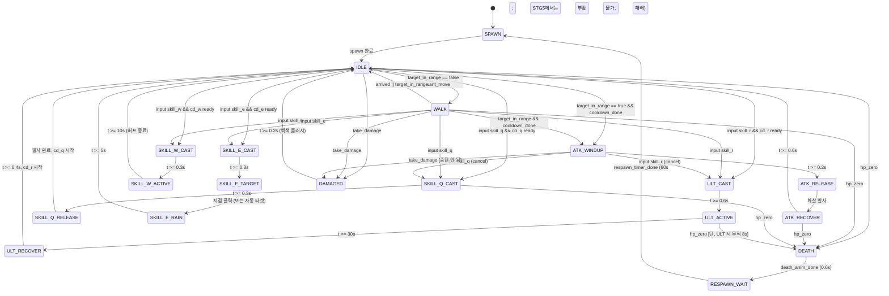
```mermaid
stateDiagram-v2
    [*] --> SPAWN
    SPAWN --> IDLE: spawn 완료
    IDLE --> WALK: target_in_range == false && want_move
    IDLE --> ATK_WINDUP: target_in_range == true && cooldown_done
    IDLE --> SKILL_Q_CAST: input skill_q && cd_q ready
    IDLE --> SKILL_W_CAST: input skill_w && cd_w ready
    IDLE --> SKILL_E_CAST: input skill_e && cd_e ready
    IDLE --> ULT_CAST: input skill_r && cd_r ready

    WALK --> IDLE: arrived || target_in_range
    WALK --> ATK_WINDUP: target_in_range && cooldown_done
    WALK --> SKILL_Q_CAST: input skill_q
    WALK --> SKILL_W_CAST: input skill_w
    WALK --> SKILL_E_CAST: input skill_e
    WALK --> ULT_CAST: input skill_r

    ATK_WINDUP --> ATK_RELEASE: t >= 0.2s
    ATK_RELEASE --> ATK_RECOVER: 화살 발사
    ATK_RECOVER --> IDLE: t >= 0.6s
    ATK_WINDUP --> SKILL_Q_CAST: input skill_q (cancel)
    ATK_WINDUP --> ULT_CAST: input skill_r (cancel)

    SKILL_Q_CAST --> SKILL_Q_RELEASE: t >= 0.3s
    SKILL_Q_RELEASE --> IDLE: 발사 완료, cd_q 시작
    SKILL_W_CAST --> SKILL_W_ACTIVE: t >= 0.3s
    SKILL_W_ACTIVE --> IDLE: t >= 10s (버프 종료)
    SKILL_E_CAST --> SKILL_E_TARGET: t >= 0.3s
    SKILL_E_TARGET --> SKILL_E_RAIN: 지점 클릭 (또는 자동 타겟)
    SKILL_E_RAIN --> IDLE: t >= 5s

    ULT_CAST --> ULT_ACTIVE: t >= 0.6s
    ULT_ACTIVE --> ULT_RECOVER: t >= 30s
    ULT_RECOVER --> IDLE: t >= 0.4s, cd_r 시작

    IDLE --> DAMAGED: take_damage
    WALK --> DAMAGED: take_damage
    ATK_WINDUP --> DAMAGED: take_damage [중단 안 됨]
    DAMAGED --> IDLE: t >= 0.2s (백색 플래시)

    IDLE --> DEATH: hp_zero
    WALK --> DEATH: hp_zero
    ATK_RECOVER --> DEATH: hp_zero
    SKILL_Q_CAST --> DEATH: hp_zero
    ULT_ACTIVE --> DEATH: hp_zero [단, ULT 시 무적 8s]
    DEATH --> RESPAWN_WAIT: death_anim_done (0.6s)
    RESPAWN_WAIT --> SPAWN: respawn_timer_done (60s; STG5에서는 부활 불가, 패배)
```

### 3.2 상태별 상세

| 상태 | 프레임 | 지속 | 루프 | 인터럽트 | 비고 |
|---|---|---|---|---|---|
| `SPAWN` | 1 | 0.4s | X | X | 페이드인 + 활시위 튕김 효과 |
| `IDLE` | 2 | 0.8s 루프 | O | O | 호흡 애니메이션 (위아래 1px) |
| `WALK` | 2 | 0.4s 루프 | O | O | 발 이동 (10s 동안 STG5만) |
| `ATK_WINDUP` | 1 | 0.2s | X | 스킬 입력만 | 활 당김 |
| `ATK_RELEASE` | 1 | 0.05s | X | X | 화살 발사 |
| `ATK_RECOVER` | 1 | 0.6s | X | 스킬 입력 | 자세 복귀 |
| `SKILL_Q_CAST` | 1 | 0.3s | X | X | 활시위 황금빛 |
| `SKILL_Q_RELEASE` | 1 | 0.1s | X | X | 황금 화살 발사 |
| `SKILL_W_CAST` | 1 | 0.3s | X | X | 입을 크게 벌림 |
| `SKILL_W_ACTIVE` | 2 | 10s | O | O | 머리 위 깃발 펄럭, 주변 아군 점프 |
| `SKILL_E_CAST` | 1 | 0.3s | X | X | 활을 위로 |
| `SKILL_E_TARGET` | 1 | 동적 | X | O | 마우스 따라 타겟 원 표시 |
| `SKILL_E_RAIN` | 1 | 5s | O | X | 머리 위 동작, 화살비 fx 떨어짐 |
| `ULT_CAST` | 3 | 0.6s | X | X | 결사 한자 페이드인, 화면 가장자리 황금 빛 |
| `ULT_ACTIVE` | 3 | 30s | O | (피해 무시 8s) | 본인 무적 8s, 전체 아군 +50% atk |
| `ULT_RECOVER` | 1 | 0.4s | X | X | 한자 페이드아웃 |
| `DAMAGED` | 1 | 0.2s | X | X | 흰색 플래시 (스프라이트 위 50% 알파 흰 오버레이) |
| `DEATH` | 3 | 0.6s | X | X | 회색 페이드 + 알파 감소 (DECISION-D-202a) |
| `RESPAWN_WAIT` | 0 | 60s | X | X | 본진 위치에 半투명 마커 + HUD에 카운트다운 (`hero.respawn_in`) |

### 3.3 양만춘 페이즈 시각 변화 (DECISION-D-204, 단계 변화)

```
[Phase 1: STG1~2]   청 두루마기 + 황토 가슴판 (기본)
       │ 스테이지 3 진입
       ▼
[Phase 2: STG3]      + 어깨에 작은 깃발 (사기 진작 해금 시각화)
       │ 스테이지 4 진입
       ▼
[Phase 3: STG4]      + 망토 (외성 방어 후 멋 더해짐)
       │ 스테이지 5 진입
       ▼
[Phase 4: STG5]      + 머리띠 + 갑옷에 흙·먼지 흔적 (88일을 버틴 흔적)
```

각 페이즈는 별도 스프라이트 시트 (`hero_yang_phase{1~4}.png`). 스테이지 진입 시 `AssetManager.image("hero_yang_phase{n}_idle")`로 스왑.

> 누적이 아니라 단계인 이유: tkinter Canvas의 레이어 합성 비용을 회피. 또한 시각적 명료성 (한 번에 한 페이즈만 보임).

### 3.4 직접 조작 모드 (M키, OPEN-D-201)

스테이지 5만. M 키 토글:

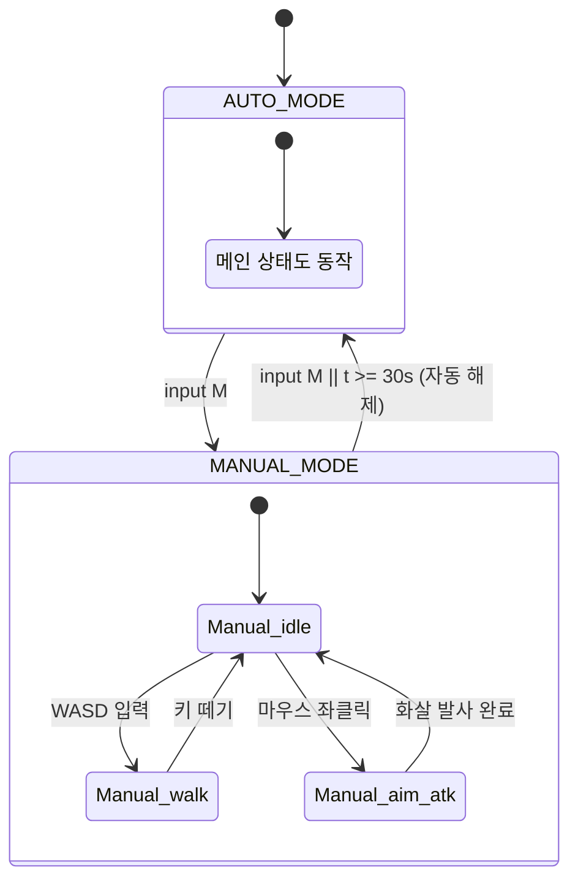
```mermaid
stateDiagram-v2
    [*] --> AUTO_MODE
    AUTO_MODE --> MANUAL_MODE: input M
    MANUAL_MODE --> AUTO_MODE: input M || t >= 30s (자동 해제)

    state AUTO_MODE {
        [*] --> Auto_ai
        Auto_ai: 메인 상태도 동작
    }

    state MANUAL_MODE {
        [*] --> Manual_idle
        Manual_idle --> Manual_walk: WASD 입력
        Manual_walk --> Manual_idle: 키 떼기
        Manual_idle --> Manual_aim_atk: 마우스 좌클릭
        Manual_aim_atk --> Manual_idle: 화살 발사 완료
    }
```

수동 모드에서는 자동 타겟팅이 꺼지고 키보드 WASD + 마우스 좌클릭으로 직접 사격. 30초 후 자동 복귀(피로 방지).

### 3.5 양만춘 스킬 쿨다운 (사이드바)

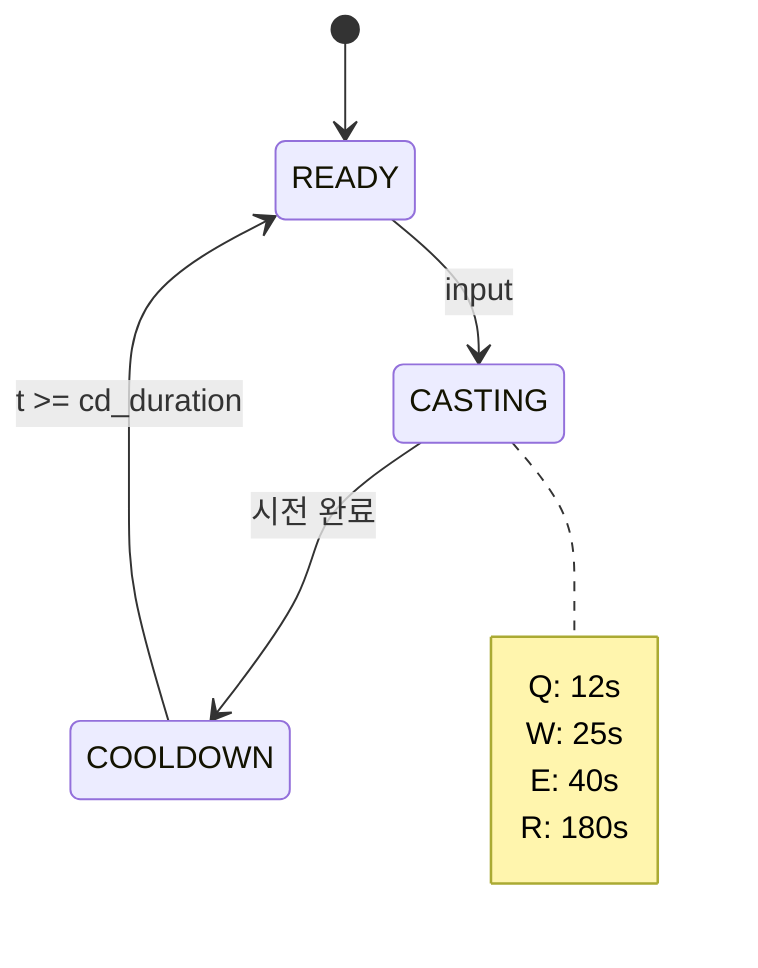
```mermaid
stateDiagram-v2
    [*] --> READY
    READY --> CASTING: input
    CASTING --> COOLDOWN: 시전 완료
    COOLDOWN --> READY: t >= cd_duration

    note right of CASTING
        Q: 12s
        W: 25s
        E: 40s
        R: 180s
    end note
```

쿨다운 UI: 스킬 슬롯에 회색 호(arc)가 시계 반대 방향으로 줄어들면서 남은 초 표시.

---

## 4. 아군 유닛 상태도 (5종)

### 4.1 공통 아군 상태도 (궁수·창병·장창병·투석수)

기병은 별도 (출격 메커닉).

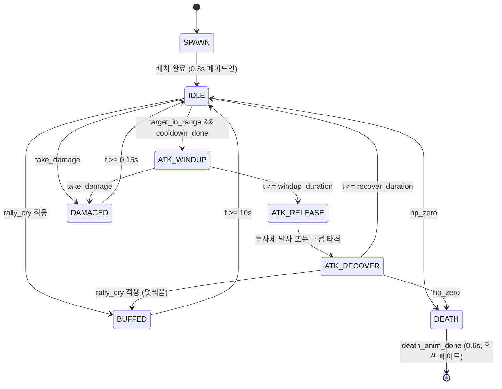
```mermaid
stateDiagram-v2
    [*] --> SPAWN
    SPAWN --> IDLE: 배치 완료 (0.3s 페이드인)
    IDLE --> ATK_WINDUP: target_in_range && cooldown_done
    ATK_WINDUP --> ATK_RELEASE: t >= windup_duration
    ATK_RELEASE --> ATK_RECOVER: 투사체 발사 또는 근접 타격
    ATK_RECOVER --> IDLE: t >= recover_duration

    IDLE --> BUFFED: rally_cry 적용
    ATK_RECOVER --> BUFFED: rally_cry 적용 (덧씌움)
    BUFFED --> IDLE: t >= 10s

    IDLE --> DAMAGED: take_damage
    ATK_WINDUP --> DAMAGED: take_damage
    DAMAGED --> IDLE: t >= 0.15s

    IDLE --> DEATH: hp_zero
    ATK_RECOVER --> DEATH: hp_zero
    DEATH --> [*]: death_anim_done (0.6s, 회색 페이드)
```

### 4.2 유닛별 파라미터

| 유닛 | windup | recover | 공격 형태 |
|---|---|---|---|
| 궁수 | 0.3s | 0.7s | 화살 발사 (사거리 320px) |
| 창병 | 0.2s | 0.5s | 근접 찌르기 (40px) |
| 장창병 | 0.4s | 0.7s | 긴 창 찌르기 (70px) |
| 투석수 | 0.8s | 2.2s | 돌 발사 (광역 80px, 사거리 420px) |

### 4.3 BUFFED 상태 시각

- 머리 위에 `ico_buff_rally` 또는 `ico_buff_attack_up` 작은 아이콘 표시
- 스프라이트 외곽선 색이 황금(#D4A84A)으로 변화 (1.5px)
- 공격속도 +30% (모든 windup/recover 0.7배)

### 4.4 기병 (출격 메커닉)

기병은 일반 배치가 아니라 출격구에서 사기 100%일 때 자동 출격.

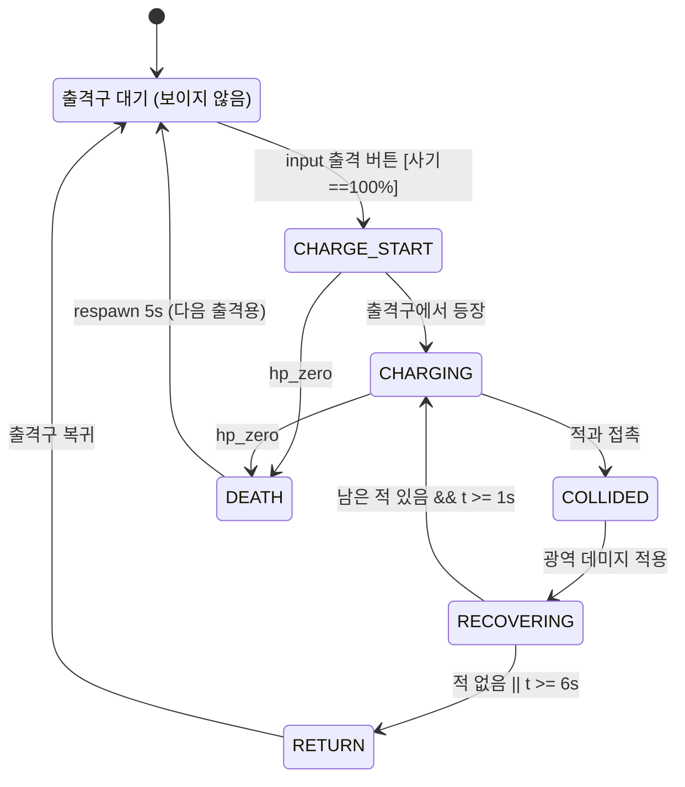
```mermaid
stateDiagram-v2
    [*] --> WAITING
    WAITING: 출격구 대기 (보이지 않음)
    WAITING --> CHARGE_START: input 출격 버튼 [사기==100%]
    CHARGE_START --> CHARGING: 출격구에서 등장
    CHARGING --> COLLIDED: 적과 접촉
    COLLIDED --> RECOVERING: 광역 데미지 적용
    RECOVERING --> CHARGING: 남은 적 있음 && t >= 1s
    RECOVERING --> RETURN: 적 없음 || t >= 6s
    RETURN --> WAITING: 출격구 복귀

    CHARGE_START --> DEATH: hp_zero
    CHARGING --> DEATH: hp_zero
    DEATH --> WAITING: respawn 5s (다음 출격용)
```

상세 동작:
- 출격 시 좌·우 출격구에서 3체 동시 등장
- 적군 진영 방향으로 직선 돌격
- 첫 적 접촉 시 광역 데미지 + 0.3s 기절
- 1초 회복 후 다시 돌격 (적 남은 경우)
- 6초 후 또는 적 전멸 시 본진 복귀
- 사기 게이지는 0으로 리셋

---

## 5. 적 유닛 상태도 (8종)

### 5.1 공통 적 상태도 (보병·궁수·중장보병·기병·친위대)

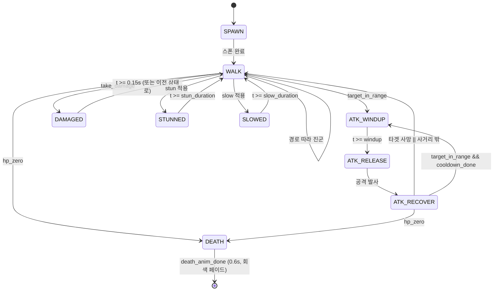
```mermaid
stateDiagram-v2
    [*] --> SPAWN
    SPAWN --> WALK: 스폰 완료
    WALK --> ATK_WINDUP: target_in_range
    WALK --> WALK: 경로 따라 진군
    ATK_WINDUP --> ATK_RELEASE: t >= windup
    ATK_RELEASE --> ATK_RECOVER: 공격 발사
    ATK_RECOVER --> WALK: 타겟 사망 || 사거리 밖
    ATK_RECOVER --> ATK_WINDUP: target_in_range && cooldown_done

    WALK --> DAMAGED: take_damage
    DAMAGED --> WALK: t >= 0.15s (또는 이전 상태로)

    WALK --> STUNNED: stun 적용
    STUNNED --> WALK: t >= stun_duration

    WALK --> SLOWED: slow 적용
    SLOWED --> WALK: t >= slow_duration

    WALK --> DEATH: hp_zero
    ATK_RECOVER --> DEATH: hp_zero
    DEATH --> [*]: death_anim_done (0.6s, 회색 페이드)
```

### 5.2 척후 (은신 보유)

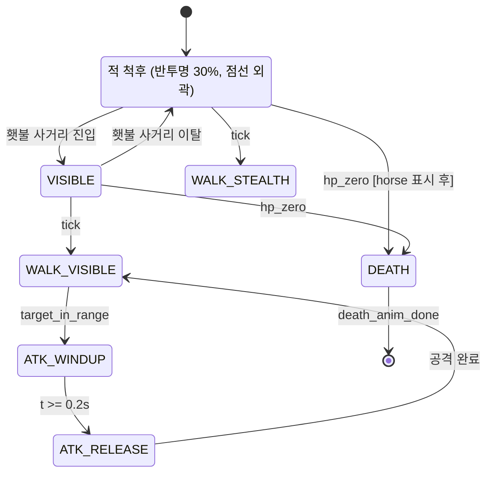
```mermaid
stateDiagram-v2
    [*] --> STEALTH
    STEALTH: 적 척후 (반투명 30%, 점선 외곽)
    STEALTH --> VISIBLE: 횃불 사거리 진입
    VISIBLE --> STEALTH: 횃불 사거리 이탈
    STEALTH --> WALK_STEALTH: tick
    VISIBLE --> WALK_VISIBLE: tick
    WALK_VISIBLE --> ATK_WINDUP: target_in_range
    ATK_WINDUP --> ATK_RELEASE: t >= 0.2s
    ATK_RELEASE --> WALK_VISIBLE: 공격 완료

    STEALTH --> DEATH: hp_zero [horse 표시 후]
    VISIBLE --> DEATH: hp_zero
    DEATH --> [*]: death_anim_done
```

> 시각: STEALTH 상태에서는 스프라이트 알파 30%, 외곽선 점선 (4px 대시). VISIBLE 진입 시 0.2초 페이드 인.

### 5.3 충차 (성문 전용 데미지)

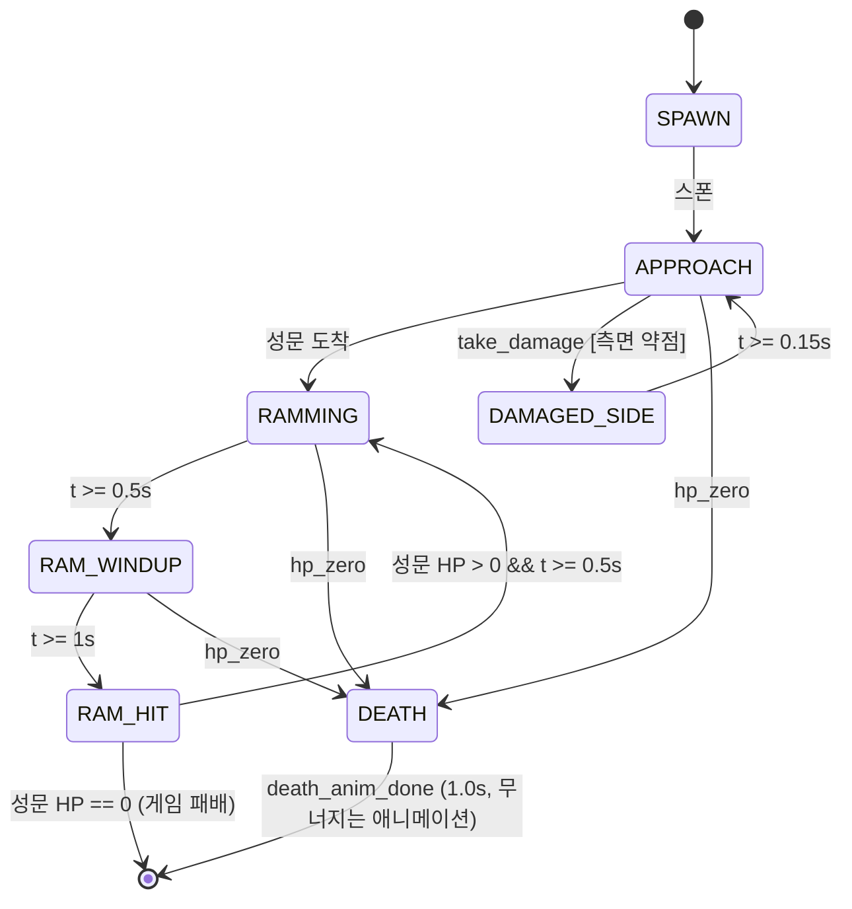
```mermaid
stateDiagram-v2
    [*] --> SPAWN
    SPAWN --> APPROACH: 스폰
    APPROACH --> RAMMING: 성문 도착
    RAMMING --> RAM_WINDUP: t >= 0.5s
    RAM_WINDUP --> RAM_HIT: t >= 1s
    RAM_HIT --> RAMMING: 성문 HP > 0 && t >= 0.5s
    RAM_HIT --> [*]: 성문 HP == 0 (게임 패배)

    APPROACH --> DAMAGED_SIDE: take_damage [측면 약점]
    DAMAGED_SIDE --> APPROACH: t >= 0.15s
    APPROACH --> DEATH: hp_zero
    RAMMING --> DEATH: hp_zero
    RAM_WINDUP --> DEATH: hp_zero
    DEATH --> [*]: death_anim_done (1.0s, 무너지는 애니메이션)
```

상세:
- HP 600, 일반 공격에 강한 데미지 감소 (-50%)
- **측면 약점**: 측면에서 공격 시 +200% 데미지
- 기병 돌격 시 측면 공격으로 간주

### 5.4 공성탑 (도착 시 궁수 토출)

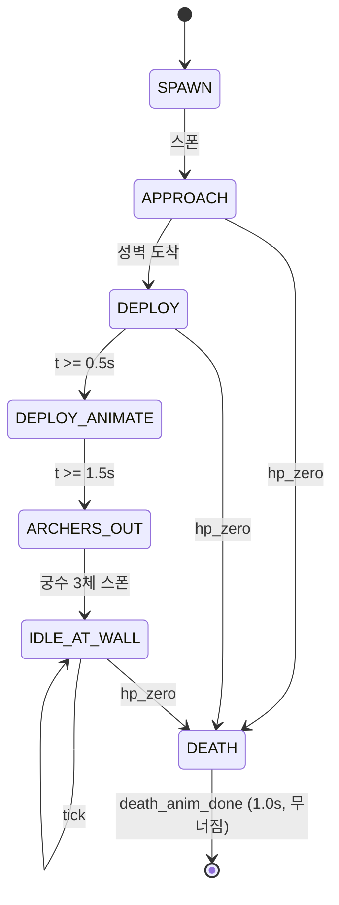
```mermaid
stateDiagram-v2
    [*] --> SPAWN
    SPAWN --> APPROACH: 스폰
    APPROACH --> DEPLOY: 성벽 도착
    DEPLOY --> DEPLOY_ANIMATE: t >= 0.5s
    DEPLOY_ANIMATE --> ARCHERS_OUT: t >= 1.5s
    ARCHERS_OUT --> IDLE_AT_WALL: 궁수 3체 스폰
    IDLE_AT_WALL --> IDLE_AT_WALL: tick

    APPROACH --> DEATH: hp_zero
    DEPLOY --> DEATH: hp_zero
    IDLE_AT_WALL --> DEATH: hp_zero
    DEATH --> [*]: death_anim_done (1.0s, 무너짐)
```

상세:
- HP 800. 도착 시 1.5초 배치 애니메이션 후 적 궁수 3체를 성벽 위에 스폰
- 그 후에는 단순히 위치만 차지 (공격 X)
- 파괴 시 위 궁수도 함께 처리

---

## 6. 보스 상태도 (4종)

### 6.1 척후대장 리우 (스테이지 1)

가장 단순한 보스. 일반 보병과 거의 동일하나 처치 시 부하 소환.

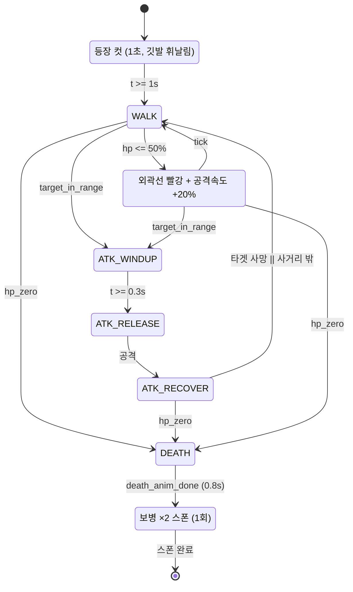
```mermaid
stateDiagram-v2
    [*] --> SPAWN_DRAMATIC
    SPAWN_DRAMATIC: 등장 컷 (1초, 깃발 휘날림)
    SPAWN_DRAMATIC --> WALK: t >= 1s
    WALK --> ATK_WINDUP: target_in_range
    ATK_WINDUP --> ATK_RELEASE: t >= 0.3s
    ATK_RELEASE --> ATK_RECOVER: 공격
    ATK_RECOVER --> WALK: 타겟 사망 || 사거리 밖

    WALK --> RAGE: hp <= 50%
    RAGE: 외곽선 빨강 + 공격속도 +20%
    RAGE --> WALK: tick
    RAGE --> ATK_WINDUP: target_in_range

    WALK --> DEATH: hp_zero
    ATK_RECOVER --> DEATH: hp_zero
    RAGE --> DEATH: hp_zero
    DEATH --> SUMMON_REINFORCEMENTS: death_anim_done (0.8s)
    SUMMON_REINFORCEMENTS: 보병 ×2 스폰 (1회)
    SUMMON_REINFORCEMENTS --> [*]: 스폰 완료
```

### 6.2 야습 부대장 장 (스테이지 3)

은신 시작. 횃불 사거리 안에서만 공격 가능.

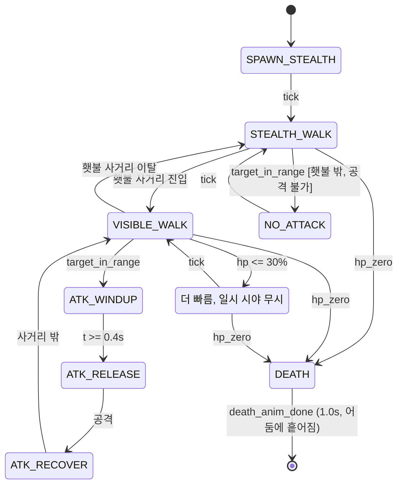
```mermaid
stateDiagram-v2
    [*] --> SPAWN_STEALTH
    SPAWN_STEALTH --> STEALTH_WALK: tick
    STEALTH_WALK --> VISIBLE_WALK: 횃불 사거리 진입
    VISIBLE_WALK --> STEALTH_WALK: 횃불 사거리 이탈
    VISIBLE_WALK --> ATK_WINDUP: target_in_range
    ATK_WINDUP --> ATK_RELEASE: t >= 0.4s
    ATK_RELEASE --> ATK_RECOVER: 공격
    ATK_RECOVER --> VISIBLE_WALK: 사거리 밖
    STEALTH_WALK --> NO_ATTACK: target_in_range [횃불 밖, 공격 불가]
    NO_ATTACK --> STEALTH_WALK: tick

    VISIBLE_WALK --> RAGE: hp <= 30%
    RAGE: 더 빠름, 일시 시야 무시
    RAGE --> VISIBLE_WALK: tick

    STEALTH_WALK --> DEATH: hp_zero
    VISIBLE_WALK --> DEATH: hp_zero
    RAGE --> DEATH: hp_zero
    DEATH --> [*]: death_anim_done (1.0s, 어둠에 흩어짐)
```

### 6.3 이세적의 정예 충차 (스테이지 4)

큰 충차 + 호위병 통합 보스. 측면 약점.

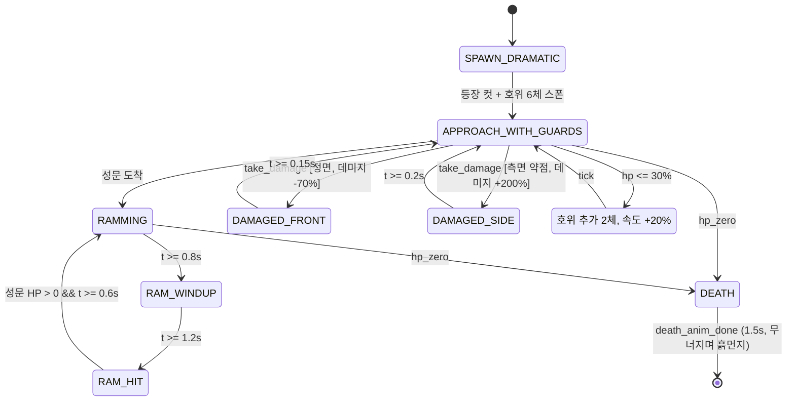
```mermaid
stateDiagram-v2
    [*] --> SPAWN_DRAMATIC
    SPAWN_DRAMATIC --> APPROACH_WITH_GUARDS: 등장 컷 + 호위 6체 스폰
    APPROACH_WITH_GUARDS --> RAMMING: 성문 도착
    RAMMING --> RAM_WINDUP: t >= 0.8s
    RAM_WINDUP --> RAM_HIT: t >= 1.2s
    RAM_HIT --> RAMMING: 성문 HP > 0 && t >= 0.6s

    APPROACH_WITH_GUARDS --> DAMAGED_FRONT: take_damage [정면, 데미지 -70%]
    APPROACH_WITH_GUARDS --> DAMAGED_SIDE: take_damage [측면 약점, 데미지 +200%]
    DAMAGED_SIDE --> APPROACH_WITH_GUARDS: t >= 0.2s
    DAMAGED_FRONT --> APPROACH_WITH_GUARDS: t >= 0.15s

    APPROACH_WITH_GUARDS --> RAGE: hp <= 30%
    RAGE: 호위 추가 2체, 속도 +20%
    RAGE --> APPROACH_WITH_GUARDS: tick

    APPROACH_WITH_GUARDS --> DEATH: hp_zero
    RAMMING --> DEATH: hp_zero
    DEATH --> [*]: death_anim_done (1.5s, 무너지며 흙먼지)
```

### 6.4 당 태종 (스테이지 5) — 4 페이즈

본 게임의 최종 보스. 4페이즈 (GDD §2.6).


```mermaid
stateDiagram-v2
    [*] --> SPAWN_GRAND
    SPAWN_GRAND: 등장 컷 (3초, BGM 전환, 화면 페이드)
    SPAWN_GRAND --> PHASE_1

    state PHASE_1 {
        [*] --> P1_MARCH
        P1_MARCH: 정면 진군 + 친위대 호위 4체
        P1_MARCH --> P1_ATK: target_in_range
        P1_ATK --> P1_MARCH: 공격 완료
    }
    PHASE_1 --> TRANSITION_1_TO_2: hp <= 75%

    TRANSITION_1_TO_2: 흰 플래시 0.5s + 무적
    TRANSITION_1_TO_2 --> PHASE_2: t >= 0.5s

    state PHASE_2 {
        [*] --> P2_MOVE_TO_TOSAN
        P2_MOVE_TO_TOSAN: 토산 정상으로 이동 (2초)
        P2_MOVE_TO_TOSAN --> P2_RANGED: 정상 도착
        P2_RANGED: 활 사격 (사거리 600px)
        P2_RANGED --> P2_RANGED: tick
    }
    PHASE_2 --> TRANSITION_2_TO_3: hp <= 50%

    TRANSITION_2_TO_3 --> PHASE_3: 흰 플래시 0.5s

    state PHASE_3 {
        [*] --> P3_RAGE_DESCENT
        P3_RAGE_DESCENT: 토산 내려와 정면 (1.5s)
        P3_RAGE_DESCENT --> P3_SUMMON: 도착
        P3_SUMMON: 친위대 +4체 소환
        P3_SUMMON --> P3_RAGE_ATK
        P3_RAGE_ATK: 빠른 근접 공격 (공속 +50%)
        P3_RAGE_ATK --> P3_RAGE_ATK: tick
    }
    PHASE_3 --> TRANSITION_3_TO_4: hp <= 25%

    TRANSITION_3_TO_4 --> PHASE_4: 흰 플래시 0.5s

    state PHASE_4 {
        [*] --> P4_RETREAT_START
        P4_RETREAT_START: 후퇴 시도, 회피 행동
        P4_RETREAT_START --> P4_FLEE_NORTH
        P4_FLEE_NORTH: 북쪽으로 도주 + HP 회복 (5%/s)
        P4_FLEE_NORTH --> P4_FLEE_NORTH: tick
        P4_FLEE_NORTH --> P4_STAND: 플레이어 추격 && 거리 <= 200px
        P4_STAND: 짧은 저항
        P4_STAND --> P4_FLEE_NORTH: t >= 3s
    }
    PHASE_4 --> DEATH: hp_zero
    PHASE_4 --> ESCAPE: 북쪽 끝 도착 [게임 패배: 추격 실패]

    DEATH --> RETREAT_CINEMATIC: death_anim_done (게임 승리)
    RETREAT_CINEMATIC: "북으로 돌아가다" 컷 (3초)
    RETREAT_CINEMATIC --> [*]
```

#### 페이즈별 시각 차이 (스프라이트 시트)

- P1: 황금 갑옷, 위엄
- P2: 활을 든 자세, 토산 위
- P3: 분노 표정(외곽선 적색), 친위대 옆에
- P4: 등을 보이고 후퇴, 망토 휘날림

---

## 7. 사망 페이드 시퀀스 (DECISION-D-202a)

모든 유닛/적의 사망은 통일된 회색 페이드.

### 7.1 사망 시퀀스 (3프레임, 600ms)

```
t=0.0s : 정상 컬러 + 알파 100% (사망 트리거)
       ↓ 0~200ms: 컬러 → 회색 페이드 (saturate 100% → 0%)
t=0.2s : 회색조 + 알파 100% (회색 페이드 완료)
       ↓ 200ms~600ms: 알파 100% → 0% (서서히 사라짐)
t=0.6s : 알파 0% (객체 풀로 반환, state="hidden")
```

mermaid 표현:

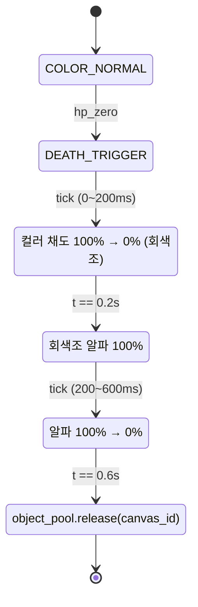
```mermaid
stateDiagram-v2
    [*] --> COLOR_NORMAL
    COLOR_NORMAL --> DEATH_TRIGGER: hp_zero
    DEATH_TRIGGER --> GRAY_FADE: tick (0~200ms)
    GRAY_FADE: 컬러 채도 100% → 0% (회색조)
    GRAY_FADE --> GRAY_VISIBLE: t == 0.2s
    GRAY_VISIBLE: 회색조 알파 100%
    GRAY_VISIBLE --> ALPHA_FADE: tick (200~600ms)
    ALPHA_FADE: 알파 100% → 0%
    ALPHA_FADE --> POOL_RETURN: t == 0.6s
    POOL_RETURN: object_pool.release(canvas_id)
    POOL_RETURN --> [*]
```

### 7.2 사망 SFX

- `sfx_unit_death_soft` (부드러운 천 소리, GDD §10.2)
- 잔혹 음향 금지

### 7.3 사망 자원 정산

- 적 사망 시: 곡식 + `gold_drop` (`docs/04` §5.2.3)
- 적 사망 시: 사기 게이지 +1~3 (유닛 종류별)
- 아군 사망 시: 인구 +1 (회복 타이머 시작)

### 7.4 사망 시각 가이드 (가족 친화 톤)

- 시신/잔재 표시 X
- 회색 페이드 외 추가 이펙트 없음 (먼지 작은 파편 1초 정도 허용)
- 절대 빨간 색이나 피 효과 사용 금지

---

## 8. 투사체 (Projectiles) 시퀀스

### 8.1 화살 (Arrow) 상태도

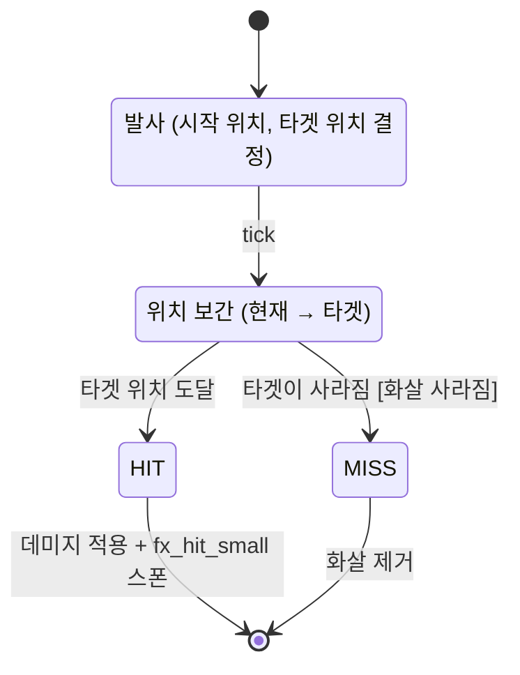
```mermaid
stateDiagram-v2
    [*] --> FIRED
    FIRED: 발사 (시작 위치, 타겟 위치 결정)
    FIRED --> FLYING: tick
    FLYING: 위치 보간 (현재 → 타겟)
    FLYING --> HIT: 타겟 위치 도달
    FLYING --> MISS: 타겟이 사라짐 [화살 사라짐]
    HIT --> [*]: 데미지 적용 + fx_hit_small 스폰
    MISS --> [*]: 화살 제거
```

상세:
- 속도: 600 px/s
- 시각: line (2px 두께) 또는 `fx_arrow_ally` PNG
- 보간: 선형 (포물선은 옵션, 비용 절약 위해 직선)
- 충돌 판정: 타겟 위치 ±10px 반경

### 8.2 돌 (Stone, 투석기)

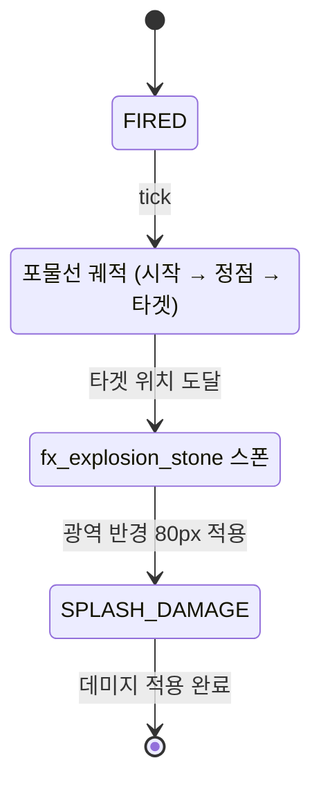
```mermaid
stateDiagram-v2
    [*] --> FIRED
    FIRED --> FLYING_ARC: tick
    FLYING_ARC: 포물선 궤적 (시작 → 정점 → 타겟)
    FLYING_ARC --> IMPACT: 타겟 위치 도달
    IMPACT: fx_explosion_stone 스폰
    IMPACT --> SPLASH_DAMAGE: 광역 반경 80px 적용
    SPLASH_DAMAGE --> [*]: 데미지 적용 완료
```

상세:
- 속도: 400 px/s 평균 (포물선)
- 정점 높이: 시작-타겟 거리의 30%
- 광역: 80px 반경, 안의 모든 적에게 데미지

### 8.3 화살비 (Arrow Rain, 양만춘 스킬 E)

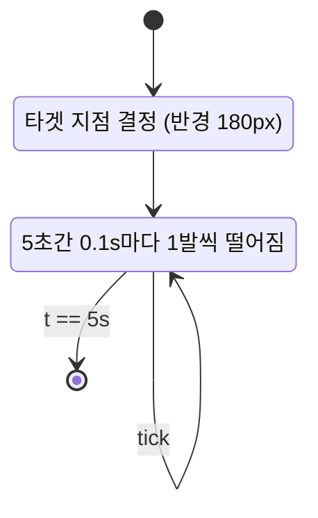
```mermaid
stateDiagram-v2
    [*] --> RAIN_START
    RAIN_START: 타겟 지점 결정 (반경 180px)
    RAIN_START --> RAINING
    RAINING: 5초간 0.1s마다 1발씩 떨어짐
    RAINING --> RAINING: tick
    RAINING --> [*]: t == 5s
```

상세:
- 5초간 총 50발 (0.1초 간격)
- 각 발은 위에서 떨어지는 검은 점선 라인 (1px)
- 데미지: 30/발 (총 150 가능, 적 중복 명중)
- 시각: `fx_arrow_rain` 스프라이트 시트 6프레임 루프

---

## 9. 이펙트 (Effects) 시퀀스

### 9.1 충격 / 히트 이펙트

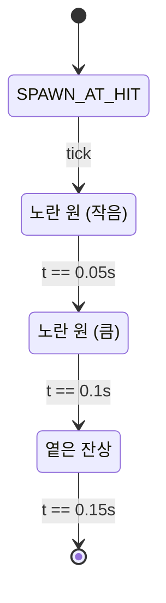
```mermaid
stateDiagram-v2
    [*] --> SPAWN_AT_HIT
    SPAWN_AT_HIT --> FRAME_1: tick
    FRAME_1: 노란 원 (작음)
    FRAME_1 --> FRAME_2: t == 0.05s
    FRAME_2: 노란 원 (큼)
    FRAME_2 --> FRAME_3: t == 0.1s
    FRAME_3: 옅은 잔상
    FRAME_3 --> [*]: t == 0.15s
```

### 9.2 폭발 이펙트 (투석)

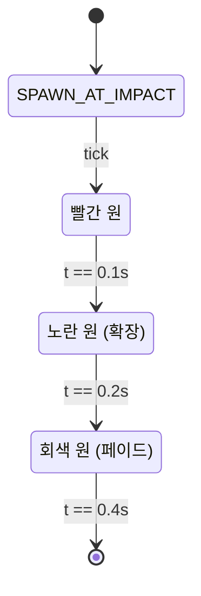
```mermaid
stateDiagram-v2
    [*] --> SPAWN_AT_IMPACT
    SPAWN_AT_IMPACT --> RED_RING: tick
    RED_RING: 빨간 원
    RED_RING --> YELLOW_RING: t == 0.1s
    YELLOW_RING: 노란 원 (확장)
    YELLOW_RING --> GRAY_RING: t == 0.2s
    GRAY_RING: 회색 원 (페이드)
    GRAY_RING --> [*]: t == 0.4s
```

GDD §9.5: 빨강 → 노랑 → 회색 3단계 페이드. 시간 가이드는 본 문서가 명세.

### 9.3 자원 토스트 (`gain.*`)

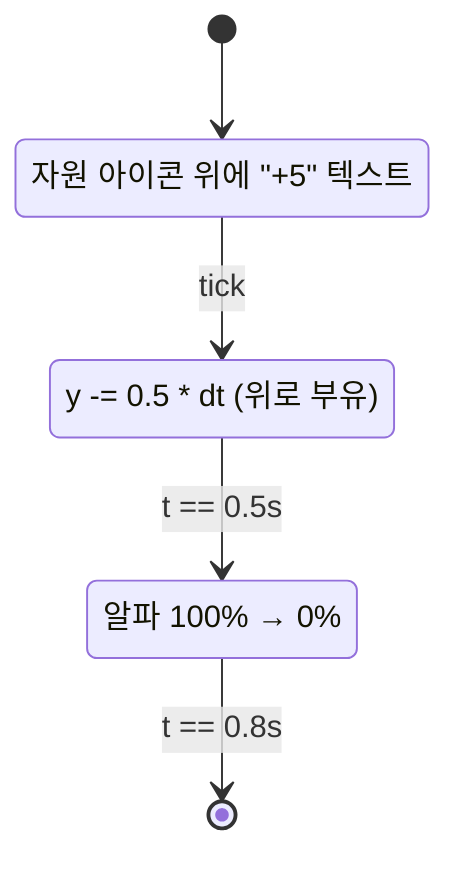
```mermaid
stateDiagram-v2
    [*] --> SPAWN_AT_HUD
    SPAWN_AT_HUD: 자원 아이콘 위에 "+5" 텍스트
    SPAWN_AT_HUD --> FLOAT_UP: tick
    FLOAT_UP: y -= 0.5 * dt (위로 부유)
    FLOAT_UP --> FADE_OUT: t == 0.5s
    FADE_OUT: 알파 100% → 0%
    FADE_OUT --> [*]: t == 0.8s
```

### 9.4 양만춘 궁극기 화면 가장자리 빛

```mermaid
stateDiagram-v2
    [*] --> ULT_ACTIVATE
    ULT_ACTIVATE --> EDGE_GLOW_FADEIN: tick
    EDGE_GLOW_FADEIN: 화면 가장자리 황토 빛 페이드인 (0.6s)
    EDGE_GLOW_FADEIN --> EDGE_GLOW_PULSE: t == 0.6s
    EDGE_GLOW_PULSE: 0.5초 주기 펄스 (알파 60%~90%)
    EDGE_GLOW_PULSE --> EDGE_GLOW_PULSE: tick
    EDGE_GLOW_PULSE --> EDGE_GLOW_FADEOUT: 궁극기 종료 (30s 후)
    EDGE_GLOW_FADEOUT: 알파 → 0% (0.6s)
    EDGE_GLOW_FADEOUT --> [*]: t == 0.6s
```

### 9.5 토산 붕괴 이펙트

```mermaid
stateDiagram-v2
    [*] --> COLLAPSE_TRIGGER
    COLLAPSE_TRIGGER: 양만춘 궁극기 R 또는 약점 공격
    COLLAPSE_TRIGGER --> DUST_RISE: tick
    DUST_RISE: 토산 주변 먼지 솟아오름 (0.5s)
    DUST_RISE --> COLLAPSE_ANIMATE: t == 0.5s
    COLLAPSE_ANIMATE: 토산 6프레임 무너짐 (0.8s)
    COLLAPSE_ANIMATE --> ENEMIES_KILLED: t == 0.8s
    ENEMIES_KILLED: 토산 위 모든 적 데미지 200 (광역)
    ENEMIES_KILLED --> DUST_SETTLE: tick
    DUST_SETTLE: 먼지 가라앉음 (1.5s)
    DUST_SETTLE --> [*]: t == 1.5s
```

---

## 10. HUD 트랜지션 (애니메이션)

### 10.1 자원 카운트 보간 (DECISION-D-207)

```mermaid
stateDiagram-v2
    [*] --> IDLE_VALUE
    IDLE_VALUE: 현재 표시값 == 실제값
    IDLE_VALUE --> CHANGING: 실제값 변경됨
    CHANGING: 0.3초 동안 ease-out cubic 보간
    CHANGING --> IDLE_VALUE: t == 0.3s

    note right of CHANGING
        ease-out cubic:
        f(t) = 1 - (1-t)^3
        매 프레임 표시값 = old + (new - old) * f(t)
    end note
```

상세:
- 곡식이 +10 변동되면 카운터가 134 → 144로 0.3초간 부드럽게 증가
- 점프 금지 (DECISION-D-207)
- 동시 변동 시 마지막 값으로 재시작

### 10.2 경고 깜빡임 (DECISION-D-208)

자원/HP 부족 시 시각 신호:

```mermaid
stateDiagram-v2
    [*] --> NORMAL
    NORMAL --> WARNING: 자원 < 10 || HP < 30%
    WARNING --> NORMAL: 자원 >= 10 && HP >= 30%

    state WARNING {
        [*] --> SINE_PULSE
        SINE_PULSE: 알파 50~100% (2Hz)
        SINE_PULSE: 색상 → 위험 빨강(#D03A2E)
        SINE_PULSE --> SINE_PULSE: tick
    }
```

- 2Hz 사인파: `alpha = 0.75 + 0.25 * sin(2π * 2 * t)` → 50%~100% 진동
- 색상: 평소 흰색 → 위험 빨강(#D03A2E)

### 10.3 별 평가 페이드인 (결과 화면)

```mermaid
stateDiagram-v2
    [*] --> RESULT_SHOWN
    RESULT_SHOWN --> STAR_1_POP: t == 1.2s
    STAR_1_POP: 별 1 페이드인 + 스케일 1.0 → 1.3 → 1.0 (0.4s)
    STAR_1_POP --> STAR_2_POP: t == 1.6s
    STAR_2_POP: 별 2 페이드인 (0.4s)
    STAR_2_POP --> STAR_3_POP: t == 2.0s
    STAR_3_POP: 별 3 페이드인 (or 회색 빈 별)
    STAR_3_POP --> COUNTUP: t == 2.6s
    COUNTUP: 명성 · 곡식 카운트업 (0.5s)
    COUNTUP --> CODEX_NOTE: t == 3.2s
    CODEX_NOTE: 도감 안내 페이드인
    CODEX_NOTE --> BUTTONS: t == 3.8s
    BUTTONS: 버튼 3개 페이드인
    BUTTONS --> [*]: t == 4.4s (별3 시 인용구 추가)
```

### 10.4 토스트 알림 (자원 부족 등)

```mermaid
stateDiagram-v2
    [*] --> TRIGGER
    TRIGGER --> FADE_IN: 알림 발생
    FADE_IN: 알파 0 → 100% (0.2s) + Y 위치 -10px → 0px
    FADE_IN --> HOLD: t == 0.2s
    HOLD: 표시 유지 (트리거별 1.0~2.5s)
    HOLD --> FADE_OUT: t == hold_duration
    FADE_OUT: 알파 100% → 0% (0.3s)
    FADE_OUT --> [*]: t == 0.3s
```

### 10.5 보스 등장 컷 (HUD 페이드)

```mermaid
stateDiagram-v2
    [*] --> BOSS_TRIGGER
    BOSS_TRIGGER --> HUD_DARKEN: tick
    HUD_DARKEN: 화면 가장자리 다크 비네팅 페이드인 (1.0s)
    HUD_DARKEN --> BOSS_NAME_SLIDE: t == 1.0s
    BOSS_NAME_SLIDE: 보스 이름 슬라이드 인 (1.0s)
    BOSS_NAME_SLIDE --> HOLD: t == 2.0s
    HOLD: 표시 유지 (1.0s)
    HOLD --> FADE_OUT: t == 3.0s
    FADE_OUT --> [*]: t == 3.5s
```

표시 내용: `boss.{KEY}.name` 큰 글씨 + `boss.{KEY}.subtitle` 부제

---

## 11. 토산 성장 시각 (DECISION-D-209)

스테이지 5의 토산은 시간에 따라 자동 성장. 좌·우 2지점.

```mermaid
stateDiagram-v2
    [*] --> NOT_BUILT
    NOT_BUILT: 토산 없음 (스테이지 시작 시점)
    NOT_BUILT --> STAGE_1: tick (W2 시작 부근, ~30s)
    STAGE_1: 작은 흙더미 (192×128, bld_tosan_stage1)
    STAGE_1 --> STAGE_2: t == 60s
    STAGE_2: 중간 (192×192, bld_tosan_stage2)
    STAGE_2 --> STAGE_3: t == 60s
    STAGE_3: 성벽 높이 (192×256, bld_tosan_stage3)
    STAGE_3 --> WEAPONIZED: t == 30s
    WEAPONIZED: 토산 위에서 적 궁수 스폰 가능
    WEAPONIZED --> COLLAPSE_PROMPT: phase 2 진입 (W7)

    COLLAPSE_PROMPT: 양만춘 R 또는 약점 공격 가능 표시
    COLLAPSE_PROMPT --> COLLAPSING: 플레이어 트리거
    COLLAPSING: 6프레임 무너짐 (bld_tosan_collapse, 0.8s)
    COLLAPSING --> COLLAPSED: t == 0.8s
    COLLAPSED: 잔해 + 적 광역 데미지 + 사기 +30
    COLLAPSED --> [*]
```

### 11.1 토산 상태별 데미지 (게이지)

| 상태 | 시각 | 적 행동 |
|---|---|---|
| NOT_BUILT | 없음 | 정면 공격만 |
| STAGE_1 | 작은 흙더미 | 정면 공격만 |
| STAGE_2 | 중간 | 정면 공격, 토산 위 보호 |
| STAGE_3 | 성벽 높이 | 정면 + 토산 위에서 성벽 직접 진입 |
| WEAPONIZED | 성벽 높이 | + 토산 위 궁수 스폰 (10초마다) |
| COLLAPSING | 무너짐 | 토산 위 적 전원 사망, 광역 데미지 |
| COLLAPSED | 잔해 | 적 진군 차단 (10초간) |

---

## 12. 사기 게이지 (Morale Gauge)

기병 출격 트리거. 적 처치 / 아군 사망으로 변동.

```mermaid
stateDiagram-v2
    [*] --> EMPTY
    EMPTY: 사기 0%
    EMPTY --> CHARGING: 적 처치 (+1~3) / 아군 사망 (-2~5)
    CHARGING: 0% < 사기 < 100%
    CHARGING --> CHARGING: tick
    CHARGING --> FULL: 사기 == 100%
    FULL: 출격 가능, 출격 버튼 활성 (펄스)
    FULL --> CHARGING: 출격 사용 (사기 0으로 리셋)
    FULL --> FULL: tick (출격 안 함)

    CHARGING --> EMPTY: 사기 == 0
```

### 12.1 사기 변동 표

| 이벤트 | 사기 변동 |
|---|---|
| 일반 적 처치 | +1 |
| 중장보병/궁수 처치 | +2 |
| 충차/공성탑 처치 | +5 |
| 보스 처치 | +30 |
| 아군 일반 사망 | -2 |
| 아군 영웅(양만춘) 사망 | -10 |
| 성문 데미지 | -1/% |
| 웨이브 완벽 격퇴 (사망 0) | +10 |

### 12.2 사기 게이지 UI 변화

- 0~30%: 회색 게이지
- 30~70%: 황토 게이지
- 70~100%: 황금 게이지 + 빛 효과
- 100%: 펄스 + 출격 버튼 글로우 (1Hz, 알파 70~100%)

---

## 13. 환경 / 배경 트랜지션

### 13.1 스테이지 진입 페이드 (SCN-04 → SCN-05)

```mermaid
stateDiagram-v2
    [*] --> BRIEFING_END
    BRIEFING_END --> FADE_TO_BLACK: 시작 버튼 또는 t == 3s
    FADE_TO_BLACK: 검은 페이드 (0.5s)
    FADE_TO_BLACK --> CANVAS_INIT: t == 0.5s
    CANVAS_INIT: 게임 캔버스 로드 (배경, 유닛 배치 슬롯)
    CANVAS_INIT --> FADE_FROM_BLACK: t == 0.3s
    FADE_FROM_BLACK: 페이드 인 (0.5s)
    FADE_FROM_BLACK --> WAVE_1_PREP: t == 0.5s
    WAVE_1_PREP: 첫 웨이브 준비 (스테이지별 25~30s)
    WAVE_1_PREP --> [*]
```

### 13.2 야간 (스테이지 3) 시야 효과

```mermaid
stateDiagram-v2
    [*] --> DARK_OVERLAY
    DARK_OVERLAY: 화면 전체 75% 다크 오버레이
    DARK_OVERLAY --> TORCH_HOLE: 횃불 배치 (단위별)
    TORCH_HOLE: 횃불 위치에 반경 120px 라이트 (radial gradient)
    TORCH_HOLE --> DARK_OVERLAY: 횃불 파괴
    TORCH_HOLE --> TORCH_HOLE: tick (펄스 +/- 5% 반경)

    note right of TORCH_HOLE
        횃불 시야 안 = 적 표시
        횃불 시야 밖 = 적 비표시 (척후/장)
    end note
```

### 13.3 스테이지 5 후반 (눈)

```mermaid
stateDiagram-v2
    [*] --> NORMAL_BG
    NORMAL_BG --> SNOW_LIGHT: phase 2 진입 (W7)
    SNOW_LIGHT: 눈송이 5개 떨어짐 (랜덤)
    SNOW_LIGHT --> SNOW_HEAVY: W9 진입
    SNOW_HEAVY: 눈송이 15개 떨어짐
    SNOW_HEAVY --> SNOW_FINAL: 당 태종 P4 진입
    SNOW_FINAL: 눈송이 25개 + 화면 톤 다운
```

눈송이는 `fx_snow_flake.png` 8×8 PNG. 단순 y-velocity로 떨어짐 (0.5~1.5 px/s).

---

## 14. 풍선 도움말 (튜토리얼) 상태도

스테이지 1 한정. `docs/07` §22 참조.

```mermaid
stateDiagram-v2
    [*] --> NOT_SHOWN
    NOT_SHOWN --> TUT_1: 게임 시작 후 1초
    TUT_1: 풍선 표시 (곡식 옆), 화살표 펄스
    TUT_1 --> NOT_SHOWN: 사용자 액션 확인
    NOT_SHOWN --> TUT_2: 첫 단계 완료
    TUT_2: 풍선 (좌패널 옆)
    TUT_2 --> NOT_SHOWN: 유닛 선택
    NOT_SHOWN --> TUT_3: 유닛 선택 완료
    TUT_3: 풍선 (성벽 슬롯)
    TUT_3 --> NOT_SHOWN: 유닛 배치
    NOT_SHOWN --> TUT_4: 첫 배치 완료
    TUT_4: 풍선 (다음 진군)
    TUT_4 --> NOT_SHOWN: 5초 또는 클릭
    NOT_SHOWN --> TUT_5: W1 격퇴
    TUT_5: 풍선 (양만춘 스킬)
    TUT_5 --> NOT_SHOWN: 스킬 발동
    NOT_SHOWN --> TUT_6: 첫 스킬
    TUT_6: 풍선 (일시정지)
    TUT_6 --> [*]: 사용자 확인
```

각 풍선:
- 페이드인 0.3s + 화살표 0.5초 주기 펄스
- 사용자 액션 또는 5초 경과 시 페이드아웃
- 한 번 표시한 풍선은 다시 안 나옴 (해당 세이브)

---

## 15. 일시정지 / 속도 변경

### 15.1 일시정지 동작

```mermaid
stateDiagram-v2
    [*] --> RUNNING
    RUNNING --> PAUSING: Space 또는 PAU 버튼
    PAUSING: 모든 update(dt) 호출 차단 (dt=0)
    PAUSING --> MODAL_SHOWN: t == 0.05s
    MODAL_SHOWN: SCN-06 일시정지 모달 표시
    MODAL_SHOWN --> RESUMING: 계속하기 또는 Space
    RESUMING: 모달 페이드아웃
    RESUMING --> RUNNING: t == 0.2s
```

### 15.2 속도 변경 (1× ↔ 2×)

```mermaid
stateDiagram-v2
    [*] --> SPEED_1X
    SPEED_1X --> SPEED_2X: F 또는 버튼
    SPEED_2X: dt 배수 * 2 (모든 시간 절반)
    SPEED_2X --> SPEED_1X: F 또는 버튼

    note right of SPEED_2X
        - 애니메이션 fps는 동일
        - 게임 로직 시간만 2배
        - 양만춘 스킬 입력 200ms 이내 보장 (docs/03 §11.5)
    end note
```

---

## 16. 에러 / 예외 / 회복 상태

### 16.1 자원 부족 시 (배치 시도)

```mermaid
stateDiagram-v2
    [*] --> NORMAL
    NORMAL --> ATTEMPT: 유닛 배치 시도
    ATTEMPT --> RESOURCE_CHECK: tick
    RESOURCE_CHECK --> SUCCESS: 자원 충분
    RESOURCE_CHECK --> FAIL: 자원 부족
    SUCCESS: 유닛 스폰, 자원 차감
    SUCCESS --> NORMAL
    FAIL: 토스트 알림 표시 (alert.grain_short)
    FAIL --> SHAKE: tick
    SHAKE: 자원 카운터 좌우로 4px 흔들림 (0.2s)
    SHAKE --> WARNING_FLASH: t == 0.2s
    WARNING_FLASH: 빨강 2회 깜빡임
    WARNING_FLASH --> NORMAL: t == 0.6s
```

### 16.2 슬롯 점유 시 (잘못된 배치)

```mermaid
stateDiagram-v2
    [*] --> NORMAL
    NORMAL --> INVALID: 점유된 슬롯 클릭
    INVALID: 토스트 (alert.slot_occupied)
    INVALID --> ERROR_X: tick
    ERROR_X: 슬롯 위에 빨간 X 마크 (0.5s)
    ERROR_X --> NORMAL: t == 0.5s
```

---

## 17. 진행도 / 세이브 트랜지션

### 17.1 자동 저장

```mermaid
stateDiagram-v2
    [*] --> AUTOSAVE_IDLE
    AUTOSAVE_IDLE --> SAVING: 스테이지 클리어 || 일시정지 모달
    SAVING: JSON 파일 쓰기 (50ms 이내)
    SAVING --> SAVE_TOAST: 저장 완료
    SAVE_TOAST: 토스트 "자동 저장되었습니다" (toast.autosave) 1.5s
    SAVE_TOAST --> AUTOSAVE_IDLE: t == 1.5s
```

### 17.2 도감 해금 토스트

```mermaid
stateDiagram-v2
    [*] --> NORMAL
    NORMAL --> UNLOCK_TRIGGER: 스테이지 클리어
    UNLOCK_TRIGGER --> TOAST_SLIDE: tick
    TOAST_SLIDE: 우측에서 슬라이드인 (0.4s)
    TOAST_SLIDE: "새 역사 노트가 도감에 추가되었습니다"
    TOAST_SLIDE --> HOLD: t == 0.4s
    HOLD: 3초 표시
    HOLD --> SLIDE_OUT: t == 3.4s
    SLIDE_OUT --> [*]: t == 3.8s
```

---

## 18. 종합 인터랙션 타이밍 표

본 게임의 모든 시각 반응 타이밍 요약. QA 인계용.

| 액션 | 응답 시간 |
|---|---|
| 버튼 호버 시각 반응 | < 100ms |
| 버튼 클릭 함몰 | 80ms |
| 화면 전환 페이드 | 200~500ms |
| 유닛 배치 시각 | 50ms |
| 유닛 사망 페이드 | 600ms |
| 화살 비행 (320px 사거리) | 약 530ms |
| 폭발 이펙트 | 400ms |
| 자원 카운트 보간 | 300ms |
| 별 페이드인 (각) | 400ms |
| 토스트 페이드 | 200ms in / 1~2.5s hold / 300ms out |
| 보스 등장 컷 | 3.5s |
| 일시정지 진입 | 50ms (즉시 dt=0) + 200ms 모달 |
| 속도 1× ↔ 2× 토글 | 즉시 |
| 양만춘 스킬 시전 | 300ms cast + 즉시 효과 |
| 양만춘 부활 | 60s |
| 토산 성장 단계 | 30s/단계 |
| 사기 게이지 도달 (적 처치당) | +1 (실시간) |
| 풍선 도움말 페이드 | 300ms in / 5s hold / 300ms out |

---

## 19. 개발 인계 체크리스트

본 문서가 개발 파트(`src/entities/*.py`)로 인계될 때 확인 항목.

### 19.1 엔티티 클래스별

- [x] 영웅: `src/entities/hero.py` — 18 상태, 페이즈 4단계, 직접 조작 모드
- [x] 아군: `src/entities/ally.py` — 8 상태 (공통), 기병 별도 상태도
- [x] 적: `src/entities/enemy.py` — 8 상태 (공통), 척후/충차/공성탑 변형
- [x] 보스: `src/entities/enemy.py` 내 보스 서브클래스 — 4 종 각각
- [x] 투사체: `src/entities/projectile.py` — 화살/돌/화살비
- [x] 이펙트: `src/entities/effect.py` — 히트/폭발/사망페이드/토스트/궁극기빛/토산붕괴

### 19.2 시스템 인터페이스

- [x] `systems/combat.py`: 데미지 적용, 사기 변동 이벤트
- [x] `systems/economy.py`: 자원 카운트, 보간 처리는 UI 측
- [x] `systems/wave.py`: 웨이브 스폰, 보스 트리거
- [x] `core/events.py`: 사망/페이즈전환/도감해금 등 도메인 이벤트

### 19.3 UI/HUD 측

- [x] 카운트 보간 (DECISION-D-207)
- [x] 경고 깜빡임 (DECISION-D-208)
- [x] 별 페이드인 시퀀스
- [x] 토스트 알림 시퀀스
- [x] 풍선 도움말 (스테이지 1 한정)

### 19.4 성능 검증 항목 (docs/04 §11.5 연결)

- [ ] 동시 화면 엔티티 60체 이하에서 60fps 유지
- [ ] 사망 페이드 동시 10체 발생 시에도 프레임 드랍 없음
- [ ] 양만춘 화살비 (50발 동시) 안정 동작
- [ ] 보스 P3 (친위대 +4 소환) 시 안정 동작
- [ ] 토산 붕괴 이펙트 (1.5초 풀스크린) 안정 동작

---

## 20. 변경 이력

| 버전 | 일자 | 내용 | 작성자 |
|---|---|---|---|
| v0.1 (Draft) | 2026-05-17 | 최초 작성. 영웅 18상태, 아군 8상태, 적 공통+3변형, 보스 4종, 이펙트·HUD 트랜지션 전체 | 디자인 리더 |

---

## 21. 다음 액션

1. 개발 파트(Tech Lead)에게 본 문서 + docs/07 + docs/08 패키지로 인계
2. PM에게 OPEN-D-201 (영웅 직접 조작 모드 상세) 결정 요청
3. M3 알파 빌드 시 본 문서의 모든 상태/전이를 QA 시나리오로 변환
4. 향후 Phase 3 (개발 파트)에서 본 상태도가 실제 코드와 일치하는지 검증

---

— 애니메이션 / 상태 다이어그램 v0.1 끝 —
