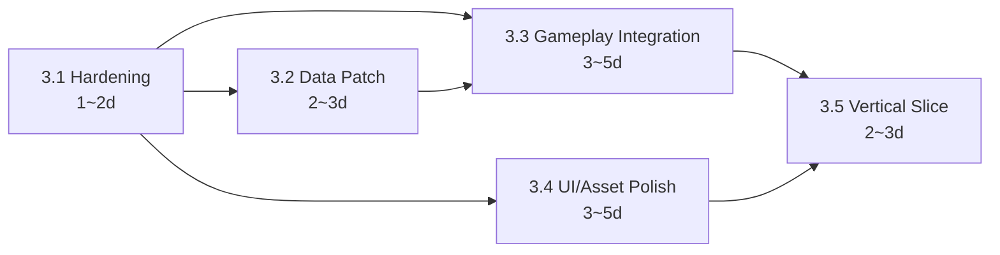

# Phase 3 계획 — 기능 통합 / 디자인·스토리 적용 / 프로토타입

- 작성: Planning Lead 페르소나 (시니어 게임 PM/Producer, 20년 경력)
- 작성일: 2026-05-19
- 베이스 커밋: `64e0969` (`origin/develop` HEAD, Phase 2 v0.2.0 완료 시점)
- 대상 산출 버전: **v0.3.0** (Phase 3 종료 태그)
- 관련 문서:
  - 상위 GDD: `docs/03_game_design_document.md`
  - 기술 가이드: `docs/04_technical_architecture.md`
  - 직전 단계 QA 리뷰/결정: `docs/qa/phase2_review.md`, `docs/qa/phase2_decisions.md`
  - CHANGELOG: `CHANGELOG.md` §[0.2.0]

> 본 문서는 사용자 부재 상황에서 Planning Lead 권한으로 작성한 "Phase 3 Kickoff" 운영 계획서다. 사용자 승인 없이 자율 진행 정책 (`feedback_autonomy_and_docs`) 에 따라 본 plan 머지 후 즉시 sub-phase 실행에 들어간다.

---

## 1. 목표 — v0.3.0 시점에 무엇을 보여줄 것인가

### 1.1 GDD §Phase 3 요건 정합

GDD `docs/03_game_design_document.md` §15 마일스톤 표상의 **M3 (1스테이지 플레이어블) ~ M4 (전 5스테이지 알파) 일부**에 해당하는 단계다. 본 plan은 그중 **M3 + M4의 전반부**를 Phase 3 범위로 잡고, M4 후반 (밸런싱 1차) 와 M5 (베타) 는 Phase 4/Phase 5로 이월한다.

요약된 Phase 3 가치 명제:

> "메뉴 → 스테이지 선택 → 스테이지 1 풀 플레이 → 결과/엔딩"의 **수직 슬라이스(Vertical Slice)** 가 처음부터 끝까지 동작하고, 디자인/스토리/UI 자산이 placeholder 기준으로 일관 적용된 상태."

### 1.2 v0.2.0 대비 추가 가치

| 영역 | v0.2.0 시점 (현재) | v0.3.0 목표 (Phase 3 종료) |
| --- | --- | --- |
| 플레이 가능성 | 단위 시스템 그린, BattleScene 통합 골격만 존재. 사용자가 처음부터 끝까지 한 판을 못 끝냄. | Stage 1을 **메뉴 → 전투 → 결과**까지 끊김 없이 플레이 가능. |
| 스테이지 데이터 | stage_01.json 1종. | stage_01 ~ stage_05 5종 JSON, loader 스키마 검증 통과. |
| 영웅 조작 | M키 플래그만 (DECISION-Q-009). | 직접 조작 모드 명세 확정 + 최소 입력→이동 구현. |
| UI 문자열 | `08_ui_strings.md` SSOT 채택, 코드/문서 중복 잔존. | SSOT 키 참조로 정리 완료, 핵심 화면 하드코딩 0건. |
| 자산 | placeholder 라벨링만. | 픽션 캐릭터 5종 placeholder 일러스트 + 한글 폰트(Noto Sans KR) 번들 구성. |
| 회귀 방지 | 가드 없음. | CI에 tkinter 도메인 가드 + stage JSON 스키마 검증. |
| 릴리즈 인프라 | v0.2.0이 의도와 달리 GA로 마킹된 후 SCM이 PATCH로 보정. | release-windows.yml 의 prerelease 판단 로직이 태그 suffix(`-alpha`/`-beta`/`-rc`)를 감지. |

---

## 2. 마일스톤 (Sub-Phases)

Phase 3을 5개 sub-phase로 분할한다. 산출물·DoD·의존성·위험을 각각 명시한다.

### 2.1 Phase 3.1 — Hardening (회귀 방지 / 기반 안정화)

- **목적**: Phase 2에서 임시로 남겨둔 위험 부채(데이터 누락, CI 가드 부재, 릴리즈 자동 GA 마킹)를 먼저 닫는다. 후속 sub-phase의 모래성을 막는다.
- **포함 작업**:
  - Issue #8 — `src/systems/*`, `src/entities/*` 에 tkinter import 금지 CI grep 가드 추가 (`.github/workflows/ci.yml`).
  - Issue #2 — `stage_01.json reward.grain` 키 추가 (DECISION-Q-011).
  - (신규) `release-windows.yml` prerelease 자동 판단 로직 — tag suffix `-alpha`/`-beta`/`-rc` 감지 시 prerelease=true.
  - (신규) `src/data/loader.py` stage JSON 스키마 검증 (jsonschema 또는 pydantic; 외부 의존을 늘리지 않고 표준 라이브러리만으로 구현 우선 검토).
- **산출물**:
  - 변경된 워크플로 파일, loader, stage_01.json.
  - 회귀 테스트: stage 스키마 위반 시 `loader.load_stage` 가 명확한 ValueError를 던지는 케이스 1건 + reward.grain 존재 케이스 1건.
- **DoD**:
  - CI에서 일부러 `src/systems/test_guard.py` 에 `import tkinter` 를 넣은 PR이 실패함을 로컬 시뮬레이션으로 확인.
  - 새 stage JSON에 `reward.grain` 누락 시 loader 가 즉시 실패.
  - 가짜 prerelease 태그 (`v0.3.0-rc.1`) 푸시 시 release-windows.yml 이 prerelease=true 로 GitHub Release 를 생성하는 로직이 워크플로 yaml 차원에서 명확히 분기되도록 변경.
- **의존성**: 없음 (병렬 시작 가능).
- **위험**:
  - loader 스키마 검증 도입 시 기존 테스트 회귀 가능성 → 도입 전 모든 stage JSON 을 사전 점검.
  - CI grep 가드의 false positive (주석 라인) → 정규식 강화(`^\s*(import|from)\s+tkinter\b`).
- **예상 기간**: 1~2일.

### 2.2 Phase 3.2 — Data Patch (스테이지 데이터 확장)

- **목적**: Stage 2~5 JSON을 추가하여 GDD의 "요동→백암→개모→안시 외곽→안시 토산" 5단 구조를 데이터 차원에서 완성한다. (게임 플레이 통합은 3.3/3.5 에서.)
- **포함 작업**:
  - (신규) `src/data/stages/stage_02.json` ~ `stage_05.json` 작성. 각 파일은 다음 키를 포함:
    - `id`, `name`, `intro_key` (ui_strings SSOT 참조), `waypoints`, `wave_schedule`, `reward { gold, grain, unlock }`.
  - 각 스테이지 메타 (난이도, 보유 메타 명성, 분기 조건 — 특히 stage_02 백암성 평화 분기 플래그) 를 stage JSON에 표현.
  - Phase 3.1 의 스키마 검증을 모든 5개 JSON에 통과시킨다.
  - `src/data/loader.py` 의 stage 목록 enumeration 함수 추가 (`list_stage_ids()`), `StageSelectScene` 이 코드 하드코딩 대신 이 함수를 사용하도록 (3.3 작업과 연계).
- **산출물**:
  - 4개 신규 JSON 파일.
  - loader 보강 + 단위 테스트 (`tests/test_stage_data_set.py` 신규).
- **DoD**:
  - 5개 stage JSON 모두 스키마 통과.
  - `loader.list_stage_ids()` 가 정확히 5건 반환.
  - stage_02 평화 분기 플래그가 명세대로 존재(GDD 의 stage 2 분기 정의 참조).
- **의존성**: Phase 3.1 의 스키마 검증 (선행 권고, 강제는 아님 — JSON 작성 자체는 병렬 가능, 검증은 3.1 머지 후 활성화).
- **위험**:
  - stage 별 wave_schedule 의 밸런스 — Phase 3 에서는 GDD 의 가설 값을 그대로 옮기고, **밸런싱 1차는 Phase 4** 로 이월.
- **예상 기간**: 2~3일.

### 2.3 Phase 3.3 — Gameplay Integration (전투 통합 디버깅)

- **목적**: BattleScene 이 데이터에서 받은 stage 정보로 실제 한 판이 돌아가게 한다. 영웅 4페이즈/궁극기/M키 직접 조작의 시각화 + 적 스폰 위치 일반화.
- **포함 작업**:
  - Issue #1 — `BattleScene._spawn_enemy()` 가 stage_data.waypoints[0] 참조 (DECISION-Q-010).
  - Issue #4 — 영웅 M키 직접 조작 모드 상세 명세 작성 (별도 doc) + 최소 동작 구현 (방향키 이동, 자동 타게팅과의 우선순위).
  - BattleScene 통합 디버깅 — `wave → pathing → combat → economy → hud` 호출 순서를 5개 stage 모두에 대해 검증.
  - 영웅 4페이즈/궁극기 시각 이펙트 (현재 placeholder 도형 + 색 점멸 수준) 가 GDD §11.2 (예전 §9·§10) 의 visual 명세대로 표시.
- **산출물**:
  - 변경된 `battle_scene.py`, `input.py`, `hero.py`, 영웅 직접 조작 명세 문서 (`docs/phase3/hero_manual_mode.md` 또는 GDD 보강).
  - 신규/갱신 테스트:
    - `tests/test_spawn_waypoint.py` — `_spawn_enemy` 가 정확히 waypoints[0] 좌표를 사용.
    - `tests/test_hero_manual_input.py` — M키 토글 + 방향키 입력 → hero.x/y 갱신.
    - `tests/test_battle_scene_multistage.py` — 5개 stage 각각에 대해 BattleScene 이 wave end + reward 적용까지 한 사이클 동작.
- **DoD**:
  - 위 테스트 모두 그린.
  - 사용자가 직접 실행 시 stage_01 메뉴 진입 → 적 스폰 → 영웅 4페이즈 전환 → 결과 화면 도달이 끊김 없이 보여짐 (Test Lead 가 3.5 에서 통합 검수).
- **의존성**: 3.1 (CI 가드, 스키마), 3.2 (5개 stage 데이터).
- **위험**:
  - tkinter Canvas 위 동시 객체 60+ 시 프레임 드랍 (GDD R1 위험) → 3.5 에서 stress 테스트 + Phase 4 로 일부 최적화 이월.
  - M키 조작 ↔ 자동 모드의 우선순위 충돌 → 명세에서 명확히 결정 (DECISION-P3-006 참조).
- **예상 기간**: 3~5일.

### 2.4 Phase 3.4 — UI/Asset Polish (시각 일관성 / 자산 placeholder)

- **목적**: 디자인 산출 (`docs/07_wireframes_visuals.md`) 을 코드에 적용하고, 자산을 placeholder 수준으로 확보한다.
- **포함 작업**:
  - Issue #5 — ui_strings.md SSOT 일관화. 코드/문서의 한국어 하드코딩 검색·치환 (DECISION-Q-003).
  - Issue #6 — 픽션 캐릭터 5종 placeholder 일러스트 (단순 도형 + 라벨 `[픽션·승인대기]` 유지 가능).
  - Issue #7 — Noto Sans KR(OFL) 번들링 — `assets/fonts/` 추가 + PyInstaller spec/`--add-data` 구성 + OFL 라이선스 텍스트 동봉.
  - 와이어프레임 docs/07~09 의 9개 화면(SCN-01~SCN-09) 중 핵심 4개 (메뉴/스테이지 선택/전투 HUD/결과) 를 코드에 반영. 색약 모드 토글(DECISION-D-005)은 settings.py 에서 읽어 widgets 가 색을 분기.
- **산출물**:
  - 갱신된 `src/ui/widgets.py`, `src/ui/hud.py`, `src/scenes/*_scene.py`.
  - `assets/fonts/NotoSansKR-Regular.ttf` (+ Bold 권장), `assets/fonts/OFL.txt`.
  - `assets/characters/` 픽션 5종 placeholder PNG (단순 도형 + 텍스트).
- **DoD**:
  - 코드 grep — `src/ui/`, `src/scenes/` 안에 한국어 문자열 리터럴이 ui_strings 키 lookup 외에는 0건.
  - PyInstaller 빌드 후 .exe 가 Noto Sans KR 로 한글을 표시. (3.5 시점 검증.)
  - 자산 인벤토리 `docs/08_asset_inventory.md` placeholder 18장 행이 모두 "확보(placeholder)" 상태.
- **의존성**: 3.1 (런타임 폰트 로드 코드 변경은 가능하면 3.1 이후), 3.2 (UI 가 stage 데이터 enumerate 사용).
- **위험**:
  - Noto Sans KR 번들 시 .exe 사이즈 증가 (~10MB) → 허용 범위로 판단, README 에 명시.
  - 픽션 캐릭터 일러스트의 품질 — Phase 3 에서는 placeholder 라벨 명시, 정식화는 Phase 4/5.
- **예상 기간**: 3~5일.

### 2.5 Phase 3.5 — Vertical Slice & Demo (수직 슬라이스 + v0.3.0-rc)

- **목적**: Stage 1을 처음부터 끝까지 플레이 가능한 수직 슬라이스 데모로 묶고, Test Lead 의 통합 검수 후 v0.3.0-rc 빌드를 만든다.
- **포함 작업**:
  - (신규) Stage 1 수직 슬라이스 시나리오: 메뉴 → "새 게임" → intro 컷씬 (텍스트 only) → stage_select (stage_01 선택) → battle (3 wave 클리어) → result (gold/grain/unlock 표시) → menu 복귀.
  - Test Lead 의 통합 검증 시나리오 작성 (`docs/qa/phase3_review.md` 의 골격).
  - v0.3.0-rc.1 태그 → release-windows.yml (Phase 3.1 개선판) 이 prerelease 로 마킹된 GitHub Release 자동 생성.
  - 회귀 테스트 보강 — pytest 200+ passed 목표.
- **산출물**:
  - 수직 슬라이스 통합 테스트 (`tests/test_vertical_slice_stage01.py`).
  - `docs/qa/phase3_review.md`.
  - GitHub Release `v0.3.0-rc.1` (prerelease) — .exe 첨부.
- **DoD**:
  - 통합 테스트 그린.
  - pytest 200건 이상 passed, ruff/black 0 에러, CI 매트릭스 (Ubuntu + Windows) 모두 그린.
  - tkinter 가드 통과.
  - v0.3.0-rc.1 Release 가 GitHub 에 prerelease 로 표시됨.
- **의존성**: 3.1 ~ 3.4 모두 머지 완료.
- **위험**:
  - 통합 시 의외의 race condition (예: dialog 가 wave 와 동시 활성) → Test Lead 가 시나리오 검수 시 발견, hotfix 라운드 1회 허용.
- **예상 기간**: 2~3일.

---

## 3. 페르소나 배정안

9 페르소나 (Planning Lead/Member, Design Lead/Member, Development Lead/Team1/Team2, Test Lead, Configuration Manager) 를 sub-phase 에 매핑한다. 각 페르소나는 자율 진행 정책에 따라 본 plan 머지 후 spawn 된다.

| 페르소나 | 주요 책임 | Phase 3 산출물 | 검수자 |
| --- | --- | --- | --- |
| **Planning Lead** | 본 plan 운영, 마일스톤 진행 추적, 가상 위클리 sync, 진행 막힘 시 결정 | `docs/10_phase3_plan.md`, `docs/phase3/checklist.md`, Phase 3 회고 (3.5 종료 시 `docs/phase3/retrospective.md`) | (없음, 본인 결정) |
| **Planning Member** | Issue/PR 트래킹 보조, 신규 backlog 후보 수집 | sub-phase 단위 progress comment, 신규 Issue 등록 보조 | Planning Lead |
| **Design Lead** | UI/Asset 시각 적용 책임. 픽션 캐릭터 5종 placeholder + Noto Sans KR 가이드 | 3.4의 자산 산출물, asset_inventory 갱신 | Test Lead |
| **Design Member** | ui_strings SSOT 일관화 (Issue #5), 화면별 placeholder 점검 | 3.4의 ui_strings 정리 결과 | Design Lead |
| **Development Lead** | 아키텍처 결정, 코드 리뷰. stage 스키마 검증 도입 (3.1) + Noto Sans KR 런타임 로드 (3.4) | loader 보강, asset 로딩 코드 | Test Lead |
| **Development Team1** | entities/systems 보강. Issue #8 (CI 가드 협업) + Issue #2 (reward.grain) + Issue #1 (spawn waypoint) | 3.1, 3.3 의 entity/systems 변경 | Development Lead |
| **Development Team2** | UI/scenes/dialog 통합. Issue #4 (M키 영웅 조작 명세+구현) | 3.3, 3.4 의 scene/UI 변경 | Development Lead |
| **Test Lead** | 마일스톤 종료마다 통합 검증 + 회귀 테스트 보강. 3.5 의 수직 슬라이스 통합 검수 | `docs/qa/phase3_review.md`, 신규 통합 테스트 | (없음, 본인 결정) |
| **Configuration Manager** | 마일스톤 단위 PR 머지, Issue 진행 트래킹, v0.3.0-rc.1 태그 + Release. release-windows.yml prerelease 로직 개선 (3.1) | 머지 커밋, 태그, Release | Planning Lead (행정 확인) |

### 3.1 isolation 정책

페르소나 isolation 규칙 (`feedback_persona_isolation.md`) 에 따라:

- **동시 2명 이상 spawn 시 Agent isolation="worktree" 필수**. 본 plan 의 sub-phase 들도 가능한 한 순차 spawn 으로 운영하고, 불가피한 병렬은 worktree 사용.
- 본 Planning Lead 작업은 단독이므로 별도 clone 폴더 (`%TEMP%\defensegame-planning`) 사용 — 본인 working tree 와 다른 페르소나 working tree 의 race 회피.

---

## 4. 작업 분할 (Issue → Sub-Phase 매핑)

| Issue | 제목 (요약) | sub-phase | 담당 페르소나 | 의존 |
| --- | --- | --- | --- | --- |
| #8 | tkinter 회귀 방지 CI 가드 | 3.1 | Dev Team1 + Configuration Manager | 없음 |
| #2 | stage_01.json reward.grain 데이터 패치 | 3.1 | Dev Team1 | 없음 |
| (신규) | release-windows.yml prerelease 로직 개선 | 3.1 | Configuration Manager | 없음 |
| (신규) | src/data/loader.py 스테이지 JSON 스키마 검증 | 3.1 | Dev Lead | #2 |
| (신규) | stages 02~05 JSON 작성 | 3.2 | Dev Team1 | 3.1 권고 |
| #1 | BattleScene._spawn_enemy waypoint 참조 | 3.3 | Dev Team1 | 3.2 |
| #4 | 영웅 M키 직접 조작 모드 명세 + 구현 | 3.3 | Dev Team2 | #1 |
| #5 | ui_strings.md SSOT 일관화 | 3.4 | Design Member | 없음 |
| #6 | 픽션 캐릭터 일러스트 5종 placeholder | 3.4 | Design Lead | 없음 |
| #7 | Noto Sans KR(OFL) PyInstaller 번들링 | 3.4 | Dev Lead | 3.4 (UI 일관화) |
| (신규) | Stage 1 수직 슬라이스 + v0.3.0-rc.1 | 3.5 | Dev Lead + Test Lead + Configuration Manager (All) | 3.1~3.4 |

> 신규 항목은 본 plan PR 머지 직후 Planning Lead/Configuration Manager 가 GitHub Issue 로 등록한다. 본 plan 작업의 §4 (신규 Issue 등록) 단계에서 4건이 실제 등록됨.

---

## 5. 일정 추정 (러프)

순차 진행 기준 총 **11~18일**. 병렬 가능 작업은 동시 진행으로 단축 가능.

### 5.1 의존성 그래프

- 임계 경로: 3.1 → 3.2 → 3.3 → 3.5 = 8~13일.
- 병렬 가능: 3.4 는 3.1 머지 직후 3.2/3.3 와 병렬 가능. 별도 페르소나 (Design Lead/Member) 가 담당하므로 worktree isolation 하 가능.

### 5.2 권장 일정

| 일 차 | 진행 sub-phase | 페르소나 |
| --- | --- | --- |
| D1~D2 | 3.1 Hardening | Dev Team1 + Configuration Manager + Dev Lead |
| D3~D5 | 3.2 Data Patch (병렬) + 3.4 UI/Asset Polish 시작 (병렬, Design Lead/Member) | Dev Team1, Design Lead, Design Member |
| D6~D10 | 3.3 Gameplay Integration + 3.4 마무리 | Dev Team1, Dev Team2, Dev Lead |
| D11~D13 | 3.5 Vertical Slice + Test Lead 통합 검수 | Test Lead, Configuration Manager |
| D14 | v0.3.0-rc.1 Release + Phase 3 회고 | Configuration Manager, Planning Lead |

(병렬 최적화 시 14일, 보수적으로 18일. 사용자 부재 자율 진행이므로 페르소나 spawn 빈도에 따라 실제 캘린더는 더 짧을 수 있다.)

---

## 6. 품질 게이트

### 6.1 매 마일스톤 종료 시

- `python -m ruff check .` 0 에러.
- `python -m black --check .` 0 변경.
- `python -m pytest -q` 0 실패.
- tkinter 도메인 가드 (3.1 도입 후) 통과.
- CHANGELOG `[Unreleased]` 섹션에 해당 sub-phase 변경 1줄 추가.

### 6.2 v0.3.0-rc.1 후보 시점

- pytest **200건 이상 passed** (현 139건 + 약 60건 추가 목표).
- 수직 슬라이스 playable: 메뉴 → stage 1 클리어 → 결과 화면 자동 시연 시연 가능 (Test Lead 시연 영상 또는 스크립트 기반 verification).
- `docs/08_asset_inventory.md` placeholder 18장 모두 lookup OK (파일 존재 + 라이센스 동봉).
- PyInstaller .exe 빌드 성공, Noto Sans KR 적용 확인.
- v0.3.0-rc.1 GitHub Release 가 prerelease 로 마킹됨.

---

## 7. 위험·완화

| ID | 위험 | 영향 | 완화책 | 담당 |
| --- | --- | --- | --- | --- |
| R-P3-01 | tkinter Canvas 동시 객체 60+ 시 프레임 드랍 | 사용자 체감 저하 | ObjectPool stress 테스트 (Phase 3.5), Phase 4 로 일부 최적화 이월 | Test Lead |
| R-P3-02 | 자산 부재로 UI 외관이 빈약 | 데모 임팩트 약함 | `[픽션·승인대기]` placeholder 라벨 정책 유지, Phase 4 에서 정식 자산 교체 | Design Lead |
| R-P3-03 | 페르소나 working tree race | 작업 손실/충돌 | isolation `worktree` 강제, 별도 clone 폴더 전략 유지 | Planning Lead |
| R-P3-04 | release-windows.yml 개선 시 회귀 | 의도와 다른 GA 마킹 재발 | dry-run 태그 (`v0.0.0-rc-test`) 로 사전 시뮬레이션, Configuration Manager 가 v0.3.0-rc.1 전에 검증 | Configuration Manager |
| R-P3-05 | stage 02~05 데이터 밸런스 불명 | 통합 시 영웅이 즉사하거나 적이 자동 클리어 | GDD 가설 값을 그대로 옮기고, **밸런싱 1차는 Phase 4 로 이월** (Phase 3 에서는 "재현 가능"이 우선) | Dev Lead |
| R-P3-06 | M키 직접 조작 ↔ 자동 모드 우선순위 모호 | 사용자 혼란 | DECISION-P3-006 으로 명시: M키 토글 ON 동안에는 자동 타게팅 OFF, 토글 OFF 시 자동 복귀 | Dev Team2 |
| R-P3-07 | ui_strings SSOT 치환 시 미발견 하드코딩 | 일부 화면에서 키 미해석 | `tests/test_no_korean_literal_in_ui.py` 추가 (정규식 grep) | Design Member |

---

## 8. Phase 3 → Phase 4 진입 기준

### 8.1 정량

- pytest **200+ passed**, 실패 0.
- ruff/black clean.
- 5 stages 모두 데이터 차원 playable (실제 wave 통과까지 가능).
- PyInstaller .exe 빌드 성공.
- GitHub Release `v0.3.0` (정식) 또는 `v0.3.0-rc.x` 가 적어도 1건 prerelease 로 게시됨.

### 8.2 정성

- Test Lead 의 `docs/qa/phase3_review.md` 종합 리뷰 결과 **Pass**.
- Configuration Manager 의 v0.3.0 태그 + Release 게시.
- Planning Lead 의 Phase 3 회고 (`docs/phase3/retrospective.md`) 작성 — 산출/리스크/Phase 4 인수인계 사항 정리.

---

## 9. DECISION-P3-### 목록

본 plan 에서 채택한 의사결정 8건. 사용자 부재 자율 진행 권한으로 Planning Lead 가 확정한다.

| ID | 의사결정 | 근거 |
| --- | --- | --- |
| **DECISION-P3-001** | Phase 3 을 5개 sub-phase (3.1 Hardening / 3.2 Data / 3.3 Gameplay / 3.4 UI/Asset / 3.5 Vertical Slice) 로 분할. | 회귀 부채 선제 해소(3.1) 후 데이터→로직→UI→통합 순으로 의존성 정렬. GDD M3 영역에 정합. |
| **DECISION-P3-002** | 5 stage 밸런싱 1차는 Phase 4 로 이월. Phase 3 에서는 "재현 가능"을 우선. | 밸런싱은 데이터+플레이테스트 라운드가 필요해 14일 일정 내 비현실적. |
| **DECISION-P3-003** | v0.3.0 정식 GA 보다 **v0.3.0-rc.1 (prerelease)** 를 Phase 3 종료 목표로 설정. 정식 v0.3.0 은 Phase 4 진입 후 통합 테스트 1라운드 추가 후 게시. | v0.2.0 자동 GA 마킹 사고 재발 방지 + 보수적 게이트 운영. |
| **DECISION-P3-004** | release-windows.yml 의 prerelease 판단을 태그 suffix (`-alpha`/`-beta`/`-rc`) 기반으로 개선. | PEP 440 prerelease 관례와 일치, 향후 자동화 안전. |
| **DECISION-P3-005** | stage JSON 스키마 검증은 외부 의존(jsonschema/pydantic) 없이 표준 라이브러리만으로 우선 구현. 표현력 부족 시에만 외부 의존 도입을 별도 Issue 로 분리. | tkinter 의 stdlib-only 정책과 일관. requirements.txt 최소화. |
| **DECISION-P3-006** | M키 영웅 직접 조작 모드: M키 토글 ON 동안에는 자동 타게팅 OFF, 토글 OFF 시 자동 복귀. 방향키로 이동, 스킬키 Q/W/E/R 은 양 모드 공통. | GDD §12.1 키보드 단축 정의에 정합 + UX 단순성. |
| **DECISION-P3-007** | 픽션 캐릭터 일러스트는 Phase 3 에서 **placeholder** 수준 (단순 도형 + `[픽션·승인대기]` 라벨) 까지만. 정식화는 Phase 4/5. | 내부 작업 일정 압박 회피 + Test Lead 의 DECISION-Q-006 권고 보존. |
| **DECISION-P3-008** | 신규 Issue 4건 (workflow prerelease / loader schema / stages 02~05 / vertical slice) 은 본 plan PR 머지 직후 Planning Lead 가 즉시 등록. | sub-phase 추적 라벨 정합 + 백로그 가시성 확보. |

---

## 10. OPEN-P3-### (후속 결정 위임)

| ID | 항목 | 위임 페르소나 |
| --- | --- | --- |
| **OPEN-P3-001** | Stage 02 의 평화 항복 분기 — 게임플레이 상 분기 시점/UI 표현 (즉시 종료 vs 별도 미니 시퀀스) | Design Lead + Dev Team2 (3.3 진행 중) |
| **OPEN-P3-002** | Noto Sans KR 외 Bold/Light weight 추가 여부 (.exe 사이즈 trade-off) | Design Lead + Configuration Manager (3.4) |
| **OPEN-P3-003** | 스테이지 5 (안시성 토산) 의 토산 메커닉 — Phase 3 에서 placeholder 수준만, 정식 구현 Phase 4 로 이월 여부 | Dev Lead (3.2 stage_05 작성 시) |
| **OPEN-P3-004** | pytest 200+ 목표 달성을 위해 어느 sub-phase 에서 어떤 테스트를 우선 보강할지 | Test Lead (3.5 진입 직전) |

---

## 11. 후속 인수인계

본 plan 머지 후 즉시 다음 페르소나를 spawn 권고:

1. **Configuration Manager** (단독 spawn) — 신규 Issue 4건 등록 + 기존 Issue sub-phase 라벨 부여 + release-windows.yml 개선 (Phase 3.1 의 Configuration Manager 분 작업).
2. (이어서) **Development Team1** — Issue #2, #8 동시 처리 (3.1).
3. (병렬, worktree isolation) **Design Lead + Design Member** — 3.4 의 ui_strings / 픽션 placeholder / 폰트 작업 선행.
4. (3.1 머지 후) **Development Lead** — loader 스키마 검증 도입 + stages 02~05 작성 (3.2).

— Planning Lead 서명. Phase 3 kickoff 정식 시작.