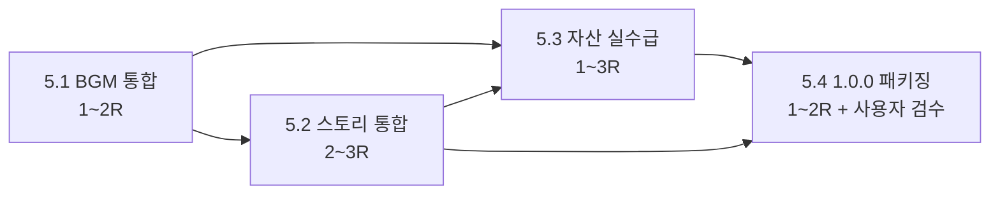

# Phase 5 계획 — 전체 스토리 통합 / 최종 완성 / 패키징·릴리즈 (1.0.0)

- 작성: Planning Lead 페르소나 (시니어 게임 PM/Producer, 20년 경력)
- 작성일: 2026-05-19
- 베이스 커밋: `0773a5f` (`origin/develop` HEAD, Phase 4 R3 종료 직후)
- 직전 GA 후보: `ca94633` (`origin/main`, v0.3.0-rc.1) — `v0.3.0` 정식 승격은 사용자 검수(CAT-01~07 + DPI 2건) 대기 중
- 대상 산출 버전(자율 결정): **v0.4.0 → v0.5.0 → v1.0.0-rc.1 → v1.0.0** (DECISION-PL-P5-001 참조)
- 관련 문서:
  - 직전 Phase plan: `docs/10_phase3_plan.md` (구조 차용)
  - Phase 4 종료 보고서: `docs/qa/phase4_completion_report.md`
  - 오디오 정책 / 인벤토리: `docs/audio/00_audio_policy.md`, `docs/audio/01_asset_inventory.md`
  - 스토리 산출물: `docs/story/00_story_bible.md` ~ `docs/story/09_codex.md`
  - 자산 인벤토리: `docs/08_asset_inventory.md`
  - 거버넌스: `docs/governance/persona_governance_decisions.md`
  - GA 체크리스트(직전): `docs/qa/v0_3_0_ga_checklist.md`
  - CHANGELOG: `CHANGELOG.md` §[Unreleased]

> 본 문서는 사용자 부재 상황에서 Planning Lead 권한으로 작성한 "Phase 5 Kickoff" 운영 계획서다. 사용자 승인 없이 자율 진행 정책(`feedback_autonomy_and_docs`)에 따라 본 plan 머지 후 즉시 sub-phase 실행에 들어간다.

---

## 1. 목표 — v1.0.0 시점에 무엇을 보여줄 것인가

### 1.1 메모리 규칙 정합

사용자 메모리(`project_overview.md`) 정의:

> **1.0.0 = Phase 5 완료(정식 릴리즈)**.
> Phase 5 정의 = "전체 스토리 적용 + 최종 완성 + 패키징/릴리즈".

본 plan은 이 정의를 그대로 수용하되, 사용자 부재 자율 진행 정책 하에서 **5.1 → 5.4** 네 라운드로 분할한 후 GA(v1.0.0) 직행이 아닌 **중간 마이너 릴리즈(v0.4.0, v0.5.0)**를 거치는 보수적 경로를 채택한다 (DECISION-PL-P5-001).

### 1.2 Phase 4 ↔ Phase 5 경계

| 영역 | Phase 4 종료 시점 (v0.3.0-rc.1 / GA 대기) | Phase 5 종료 시점 (v1.0.0) |
| --- | --- | --- |
| 스토리 통합 | docs/story/ 산출물만 SSOT 등록 (ui_strings §20 35건 한국어 확정). 인게임은 placeholder 텍스트 위주 | 전 5스테이지 intro/outro 컷씬 실 통합 + 양만춘 [전승] 톤·5인 픽션 캐릭터 대사 실제 출력 |
| 오디오 | SFX simpleaudio 백엔드(8 placeholder WAV) + AU-01~08 자동화 | BGM 백엔드 도입(8곡, OGG Vorbis) + 실 자산 수급 또는 [전승]/CC0 제작 |
| 시각 자산 | 픽션 캐릭터 placeholder 5종(단순 도형 + 라벨) | 정식 일러스트 또는 강화된 placeholder (DECISION-PL-P5-002) |
| 자동 가드 | pytest **448 passed**, 회귀 매트릭스 v2.3 (64 시나리오) | pytest **500+ passed** 목표, 회귀 매트릭스 v3 (80+ 시나리오) |
| GA 게이트 | 자동 가드 8/8 ✓ + 사용자 검수 0/7 ☐ + DPI 0/2 ☐ (v0.3.0 GA 대기) | v1.0.0 정식 릴리즈 + (선택) 매크로 OS(Linux/macOS) 빌드 검증 |
| 페르소나 | 11명 (Audio Engineer 신설, QA Lead 활성화) | 후보: Localization Engineer / Release Engineer 신설 검토 (DECISION-PL-P5-003) |

### 1.3 비전 한 줄

> "다섯 성(요동→백암→개모→안시 외곽→안시 토산)을 처음부터 끝까지 **스토리·음악·UI 모두 정식 톤**으로 끝까지 플레이 가능하며, 사용자가 .exe 더블클릭으로 즉시 실행할 수 있는 1.0.0 정식 릴리즈."

---

## 2. 라운드 분할 (Sub-Phases)

Phase 5를 4개 sub-phase로 분할한다. 각 라운드는 독립 PR 머지 가능한 단위이며, 종료 시점마다 마이너 릴리즈 또는 RC 태그를 발행한다.

### 2.1 Phase 5.1 — BGM 통합 (Audio Engineer 주도)

- **목적**: Issue #30 (Audio asset inventory — BGM 자산 발주)을 정식 클로즈한다. Phase 4 후반의 simpleaudio SFX 패턴을 그대로 확장하되, BGM 백엔드는 **OGG Vorbis** 재생을 위해 별도 검토(DECISION-AUDIO-003).
- **대상 버전**: `v0.4.0` (마이너 증가). Phase 5의 첫 산출이므로 PATCH가 아닌 MINOR.
- **포함 작업**:
  - `src/core/sound.py` BGM 백엔드 추가 — OPEN-AUDIO-001 결정 마감(simpleaudio는 OGG 미지원 → pygame.mixer 또는 다른 경량 옵션을 Audio Engineer가 비교 결정).
  - `assets/audio/bgm/` 8 placeholder OGG (무음 또는 짧은 사인파, 게임플레이 영향 0) + 라이선스 노트.
  - `docs/audio/01_asset_inventory.md` BGM 8행 상태를 `[픽션·승인대기]` → `[픽션]`/`[자체제작]`로 갱신 (실 자산 수급은 5.3에서).
  - `tests/test_sound_bgm.py` 신규 — BGM 루프 시작/중단, 페이드인/아웃 mock 검증, 헤드리스 graceful fallback.
  - PyInstaller spec `datas` 에 `assets/audio/bgm/` 추가 (DECISION-AUDIO-009 패턴).
- **Acceptance Criteria** (5건):
  1. `SoundManager.play_bgm("main_menu")` 호출 시 백엔드 미존재 환경에서도 예외 없음.
  2. `tests/test_sound_bgm.py` 신규 10+건 그린.
  3. `pytest -m audio` 선택 실행이 기존 18건 + 신규 BGM 10+건 모두 그린.
  4. ubuntu CI에서 BGM 백엔드 미설치 fallback 동작 검증 (CI yaml 변경 최소화).
  5. PyInstaller `--onefile` 빌드 사이즈 ≤ **40MB** (예산 50MB 대비 안전 마진).
  6. (선택) `docs/audio/00_audio_policy.md` OPEN-AUDIO-001 → DECISION-AUDIO-013 으로 클로즈.
- **의존성**: 없음. Audio Engineer 단독 작업, Dev Lead 코드 리뷰.
- **위험**:
  - pygame 풀 패키지(~15MB) 도입 시 .exe 사이즈 → 별도 백엔드 후보(`pyminiaudio`, `playsound3` 등) Audio Engineer 자율 비교.
  - BGM 동시 재생 중 SFX 동시성 회귀 → AU-07 시나리오를 BGM/SFX 동시 재생 시나리오로 확장.
- **예상 기간**: 1~2 라운드.

### 2.2 Phase 5.2 — 전체 스토리 통합 (Design Lead + Dev Team2 협업)

- **목적**: `docs/story/01_intro.md` ~ `07_ending.md`의 산출물을 실 인게임 컷씬·텍스트 페이지로 통합한다. Phase 3.4·4의 ui_strings §20 (35건 한국어 확정) 위에 쌓는다.
- **대상 버전**: `v0.5.0` (Phase 5.1 머지 후 다음 마이너).
- **포함 작업**:
  - `src/scenes/intro_scene.py` 신규 또는 `menu_scene.py` 확장 — 인트로(요동성 행군 직전) 컷씬 텍스트 + (Phase 5.1 BGM `bgm_main_menu` 동기화) + 색약 모드 호환.
  - 각 스테이지 진입 시 **stage intro 대사 5종**(`docs/story/02~06`의 cold-open 대사) 풀스크린 또는 dialog overlay로 출력.
  - 각 스테이지 클리어 시 **stage outro 대사 5종** 출력. stage_05 클리어 시 → 엔딩(`07_ending.md`) 풀 시퀀스 + `bgm_ending_victory`.
  - 5인 픽션 캐릭터(모용손/향이/리우/장/양만춘) **대사 SSOT**를 `docs/story/08_ui_strings.md`에 보강 — 양만춘 화자 톤은 **[전승]** 라벨 명시(역사 인물 직접 인용 회피 정책).
  - `tests/test_story_integration.py` 신규 — 5스테이지 intro/outro 텍스트가 ui_strings 키로 정확히 lookup, scene 전환 흐름 회귀 가드.
  - `docs/story/08_ui_strings.md` §21 (Phase 5 신규) — intro/outro/엔딩 대사 60~80건 한국어 확정.
- **Acceptance Criteria** (6건):
  1. 5스테이지 모두 intro/outro 대사 출력 — pytest 회귀 가드 그린.
  2. 인트로/엔딩 컷씬 키보드 ESC/SPACE 스킵 가능, M키 모드 토글과 충돌 없음.
  3. ui_strings.md 신규 60+건 모두 SSOT 키 lookup (`tests/test_no_korean_literal_in_ui.py` 가드 그린).
  4. 양만춘 화자 라벨 **[전승]** 명시 (DECISION-DESIGN-P4-* 정합).
  5. stage_02 백암성 평화 항복 분기 텍스트(`docs/story/03_stage_02_백암성의_항복.md` 참조) 게임 내 실 표시.
  6. pytest 누적 480+ passed (Phase 4 종료 448 + 신규 30+).
- **의존성**: 5.1 (BGM ID `bgm_main_menu`, `bgm_ending_*` 사용 가능 상태) — 단, BGM 미수급 상태에서도 텍스트 통합은 가능.
- **위험**:
  - 대사 60+건 추가 시 한국어 리터럴 가드 회귀 → Design Member가 SSOT 치환 동시 진행.
  - 풀스크린 컷씬 시 영웅 위치/타이머 상태 보존 → BattleScene Pause 패턴 활용.
- **예상 기간**: 2~3 라운드.

### 2.3 Phase 5.3 — 자산 실수급 / 최종 완성 (Audio Engineer + Design Lead + 외부 의존)

- **목적**: 5.1·5.2까지의 placeholder를 **실 라이선스 자산**으로 교체한다. 외부 의존(freesound/opengameart 검수, 또는 자체 제작) 비중이 커서 시간 변동 가능.
- **대상 버전**: `v1.0.0-rc.1` (Release Candidate). Phase 5의 자산 수급이 충분히 완성되면 RC 진입.
- **포함 작업**:
  - **BGM 8곡 실 수급**: freesound.org 또는 opengameart.org에서 CC0/CC BY 4.0 BGM 발굴, 또는 자체 제작 ([자체제작] 또는 [전승] 라벨). 라이선스 출처 URL/저작자 `docs/audio/01_asset_inventory.md` 기입.
  - **SFX 보강**: 현재 8 placeholder WAV(무음) → 실 SFX 교체. 20개 풀세트로 확장 (DECISION-AUDIO-001 카테고리 기준).
  - **픽션 캐릭터 일러스트** 5종: 현재 placeholder(단순 도형) → **선택 옵션** (DECISION-PL-P5-002):
    - 옵션 A: 정식 일러스트 (AI 생성 또는 외주). 라벨 `[픽션]`.
    - 옵션 B: 강화된 placeholder (도형 + 색상 팔레트 + 픽토그램). 라벨 `[픽션·placeholder-v2]` 유지.
    - 본 plan 자율 결정: **옵션 B** 우선, 옵션 A는 Phase 5.4 직전 시간 여유 있을 시 점진 교체.
  - 시각 매트릭스 패스: `docs/qa/regression_matrix.md` 시각 시나리오 갱신 + Test Lead 통합 검수.
  - `docs/08_asset_inventory.md` placeholder 18장 → `[확정]` 또는 `[자체제작]`로 전환.
- **Acceptance Criteria** (5건):
  1. BGM 8곡 모두 라이선스 적합(CC0/CC BY 4.0/CC BY-SA 4.0 조건부) 자산으로 교체, `docs/audio/01_asset_inventory.md` 출처/저작자 기입.
  2. SFX 20개 실수급 (또는 자체 제작) + AU-01~08 회귀 가드 그린.
  3. `docs/08_asset_inventory.md` `[픽션·승인대기]` 행 0건 (모두 `[픽션]`/`[자체제작]`/`[확정]` 중 하나).
  4. PyInstaller `--onefile` 빌드 사이즈 ≤ **50MB** (DECISION-AUDIO-010 예산).
  5. Test Lead 시각 매트릭스 검수 보고서 작성 (`docs/qa/phase5_visual_review.md`).
- **의존성**: 5.1 (BGM 백엔드), 5.2 (스토리 통합 텍스트가 BGM/SFX 큐와 동기화).
- **위험**:
  - 외부 자산 라이선스 검증 실패 → `docs/audio/00_audio_policy.md` §4 정책에 따라 `[픽션·승인대기]` 유지하고 자체 제작 placeholder 대체 (5.4로 이월).
  - .exe 사이즈 50MB 초과 → SFX 일부 OGG 변환 또는 BGM q5 → q4 다운그레이드.
- **예상 기간**: 외부 의존이라 시간 변동, 1~3 라운드.

### 2.4 Phase 5.4 — 1.0.0 패키징 / 릴리즈 (SCM 또는 Release Engineer 신설 시 분리)

- **목적**: v1.0.0-rc.1 → 사용자 시각 검수 → v1.0.0 GA. CI/CD 보강, 코드 서명 검토, 매크로 OS 지원 검토.
- **대상 버전**: `v1.0.0`.
- **포함 작업**:
  - **자동 릴리즈 노트 생성**: `release-windows.yml`에 `gh release create --generate-notes` 또는 release-please-action 검토. 현재 수동 작성 → 자동 + 수동 보강 하이브리드.
  - **코드 서명 검토** (DECISION-PL-P5-004 자율 결정 보류 가능): Windows .exe 미서명 → SmartScreen 경고. 자율 결정: **본 라운드는 미서명 유지** (학습 프로젝트 비용·인증서 정책 미수립). README에 SmartScreen 경고 우회 가이드 추가.
  - **매크로 OS(Linux/macOS) 지원 검토**: tkinter는 크로스플랫폼이지만 simpleaudio/BGM 백엔드 의존 검증 필요. 자율 결정 (DECISION-PL-P5-005): **Linux 빌드 CI 추가**, macOS는 OPEN-PL-P5-002로 보류.
  - **사용자 시각 검수 카탈로그 v2** (`docs/qa/v1_0_0_ga_checklist.md`): v0.3.0 GA 체크리스트 패턴 차용. CAT-01~10 (확장), DPI 매트릭스, 매크로 OS 1건 추가.
  - **v1.0.0 태그 + GitHub Release prerelease=false**: 사용자 검수 통과 후 SCM이 별도 라운드에서 진행.
  - **Phase 5 회고** `docs/phase5/retrospective.md` 작성 — 전체 5 Phase 산출 종합.
- **Acceptance Criteria** (5건):
  1. `v1.0.0-rc.1` GitHub Release 자동 게시 (prerelease=true). 자동 릴리즈 노트 생성 검증.
  2. Linux 빌드 CI 그린 (`build-linux.yml` 신규 또는 `ci.yml` 확장). macOS는 보류.
  3. `docs/qa/v1_0_0_ga_checklist.md` 발행 — 자동 가드 N/N + 사용자 검수 0/10 ☐ 초기 상태.
  4. README "현재 진행 상태" 표에 Phase 5 ✅ 완료 (v1.0.0) 표시 — 사용자 검수 통과 후 SCM 별도 라운드에서 갱신.
  5. CHANGELOG `[1.0.0]` 섹션 — Phase 5 전체 산출물 요약 + DECISION-PL-P5-### 목록 포함.
- **의존성**: 5.1~5.3 모두 머지 완료, pytest 500+ passed 안정.
- **위험**:
  - 사용자 검수 의존(Phase 4와 동일 패턴) → 자동 가드 N/N ✓ 후 사용자 복귀 대기, 별도 SCM 라운드 처리.
  - Linux 빌드 시 simpleaudio `libasound2` 의존 → ubuntu apt 설치 step 기존 보존.
- **예상 기간**: 1~2 라운드 + 사용자 검수 대기.

---

## 3. 의존성 / 외부 자산 정책

### 3.1 라이선스 호환

- **BGM/SFX/일러스트** 자산 수급 시 항상 **OFL 1.1 / CC0 1.0 / CC BY 4.0 / CC BY-SA 4.0** 호환 (DECISION-AUDIO-005, `docs/audio/00_audio_policy.md` §4).
- 외부 자산 추가 시 `assets/<카테고리>/LICENSE.txt` 또는 인벤토리 doc에 출처 URL + 저작자 + 라이선스 ID 명시.
- **MP3 회피** (DECISION-AUDIO-007) — Phase 5에서도 유지.

### 3.2 픽션 캐릭터 일러스트

- 현재(Phase 4 종료) placeholder 5종 (단순 도형 + `[픽션·승인대기]` 라벨).
- **자율 결정 DECISION-PL-P5-002**: Phase 5.3에서 **강화된 placeholder(옵션 B)** 우선, 정식 일러스트(옵션 A)는 시간 여유 있을 시 점진 교체. 사용자 복귀 후 별도 라운드에서 옵션 A 결정 가능.

### 3.3 한자 글리프 / 다국어 폰트

- **Noto Sans KR** (OFL 1.1) 이미 번들 (Phase 3.4, DECISION-Q-007).
- 추가 폰트(예: Noto Sans CJK 일본어/중국어) 도입 시 동일 OFL 패턴. **현 Phase 5에서는 추가 폰트 도입 없음** (한국어 단일 출시).

### 3.4 외부 패키지 추가 정책

- Phase 5.1 BGM 백엔드 결정 시 외부 패키지 도입 가능 (DECISION-AUDIO-004 절차 — Dev Lead 승인 필수).
- 그 외 신규 외부 패키지 추가는 본 Phase 5에서 **금지** (학습 프로젝트 의존성 최소화 원칙 유지).

---

## 4. 위험 항목

| ID | 위험 | 영향 | 완화책 | 담당 |
| --- | --- | --- | --- | --- |
| R-P5-01 | BGM 백엔드(pygame.mixer 등) ubuntu CI 헤드리스 호환 | CI 그린 실패 → 머지 차단 | Phase 4 R2 simpleaudio 패턴(graceful fallback) 그대로 적용, ubuntu에서 백엔드 미로드 시 no-op 처리 | Audio Engineer |
| R-P5-02 | PyInstaller `--onefile` .exe 크기 50MB 초과 | 사용자 다운로드 시간 증가, 정책 위반 | BGM q5 → q4 다운그레이드, SFX 일부 OGG 변환, Phase 5.3 단계에서 측정 | Audio Engineer + SCM |
| R-P5-03 | 사용자 검수 의존으로 GA 진입 지연 | 일정 슬립 | Phase 4 패턴 동일 — 자동 가드 N/N ✓ 후 별도 SCM 라운드, README/CHANGELOG에 "대기 중" 명시 | Planning Lead |
| R-P5-04 | 외부 자산 라이선스 검증 실패 / 출처 불명 | 라이선스 위반 위험 | `docs/audio/00_audio_policy.md` §4 정책 엄격 적용, `[픽션·승인대기]` 유지 + 자체 제작 placeholder 대체 | Audio Engineer + Design Lead |
| R-P5-05 | 스토리 컷씬 통합 시 BattleScene 상태 race | 게임 진행 멈춤 또는 데이터 손실 | scene_manager pause 패턴(Phase 4 튜토리얼 #36 차용), 통합 테스트 회귀 가드 | Dev Team2 |
| R-P5-06 | Linux 빌드 CI 추가 시 ci.yml 회귀 | windows/ubuntu matrix 깨짐 | 별도 `build-linux.yml` 워크플로 신설(독립), 기존 ci.yml 무변경 | SCM (또는 Release Engineer) |
| R-P5-07 | 코드 서명 미적용으로 Windows SmartScreen 경고 | 사용자 첫 실행 거부감 | 본 라운드 미서명 유지 결정(DECISION-PL-P5-004), README에 우회 가이드 추가 | SCM |
| R-P5-08 | 페르소나 신설(Localization/Release) 표결 지연 | Phase 5.4 분담 모호 | 본 plan은 제안만, Steering 후속 라운드 표결. 미신설 시 SCM이 Release Engineer 역할 겸임 | Planning Lead → Steering |

---

## 5. 일정 추정 (자율 추정)

순차 진행 기준 총 **6~10 라운드** (1 라운드 ≈ 1 페르소나 spawn 작업 단위). 병렬 가능 작업은 worktree isolation 하 동시 진행.

### 5.1 의존성 그래프

- 임계 경로: 5.1 → 5.2 → 5.3 → 5.4 = 5~10 라운드.
- 병렬 가능: 5.1 머지 직후 5.2와 5.3(외부 자산 발굴) 동시 진행 가능 — Audio Engineer(5.1·5.3) + Design Lead/Dev Team2(5.2) 별도 worktree.

### 5.2 권장 일정

| 라운드 | 진행 sub-phase | 페르소나 |
| --- | --- | --- |
| R1~R2 | 5.1 BGM 백엔드 + placeholder | Audio Engineer (단독), Dev Lead (리뷰) |
| R3~R5 | 5.2 스토리 통합 (병렬) + 5.3 자산 발굴 시작 | Design Lead + Dev Team2 + Design Member (한국어 SSOT), Audio Engineer (자산) |
| R6~R7 | 5.3 자산 교체 마무리 + Test Lead 시각 매트릭스 | Audio Engineer + Design Lead + Test Lead |
| R8~R9 | 5.4 v1.0.0-rc.1 + Linux CI + GA 체크리스트 | SCM (또는 Release Engineer 신설 시 분리), Planning Lead (회고) |
| R10 | v1.0.0 GA — 사용자 검수 통과 후 별도 SCM 라운드 | SCM |

(병렬 최적화 시 6~7 라운드, 보수적으로 10 라운드. 사용자 검수 대기 시간은 미포함.)

---

## 6. 품질 게이트

### 6.1 매 라운드 종료 시

- `python -m ruff check .` 0 에러.
- `python -m black --check .` 0 변경.
- `python -m pytest -q` 0 실패 (Phase 4 R3 종료 448 → Phase 5 종료 500+ 목표).
- pytest markers 일관 적용 (`regression_p4` → `regression_p5` 신설 검토, DECISION-QA-P5-### 자율).
- tkinter 도메인 가드(Phase 3.1 도입) 통과.
- CHANGELOG `[Unreleased]` 섹션에 해당 sub-phase 변경 1줄 추가.

### 6.2 v1.0.0-rc.1 후보 시점 (Phase 5.4 진입)

- pytest **500+ passed**, 실패 0.
- ruff/black clean.
- 5스테이지 모두 intro/outro 컷씬 + BGM/SFX 동기화 동작.
- `docs/08_asset_inventory.md` `[픽션·승인대기]` 0건.
- PyInstaller .exe 빌드 성공, 사이즈 ≤ 50MB.
- v1.0.0-rc.1 GitHub Release prerelease=true 자동 게시.
- (선택) Linux 빌드 그린.

### 6.3 v1.0.0 GA 시점

- v1.0.0-rc.1 RC가 적어도 1주 이상 머지 후 사용자 검수 진행.
- `docs/qa/v1_0_0_ga_checklist.md` 사용자 검수 N/N ✓ + DPI 매트릭스 통과.
- SCM 별도 라운드에서 `develop → main` 머지 + `v1.0.0` 태그 + GitHub Release prerelease=false 전환.

---

## 7. 페르소나 거버넌스 검토 (제안만, 표결은 후속 라운드)

현재 11 페르소나 (Phase 4에서 Audio Engineer 신설, QA Lead 활성화). Phase 5 진입 시 추가 검토 후보:

### 7.1 Localization Engineer (i18n) — 자율 결정 보류 / OPEN

- **사유 후보**: 영어 번역 검토 (한국어 단일 출시 → 영어 동시 출시 검토). 한자 글리프(중국 인명·지명) 표기 정책 수립.
- **자율 결정 DECISION-PL-P5-003** (자율 결정 보류 → **OPEN-PL-P5-001**로 전환): 본 plan에서 신설하지 않음. Phase 5는 **한국어 단일 출시**를 우선하고, 영어 번역은 v1.0.0 이후 별도 마이너(v1.1.0) 또는 Phase 6 마이너 라운드로 분리. Steering 후속 라운드에서 표결 가능.

### 7.2 Release Engineer — 분리 vs 겸임 자율 결정

- **사유**: 1.0.0 패키징 전담. 현재 SCM 페르소나가 머지/태깅/Release까지 겸임 중. Phase 4 R3에서 SCM 사용량 한도 도달 사례(DECISION-SCM-P4F-002).
- **자율 결정 DECISION-PL-P5-006**: 본 plan 단독으로 신설하지 않음. **SCM이 Release Engineer 역할 겸임 유지**, Phase 5.4 라운드 진입 시 SCM 사용량 모니터링하고 한도 도달 시 Steering 표결로 신설 검토 (OPEN-PL-P5-002).

### 7.3 본 plan에서 페르소나 명단 변경 없음

본 plan은 신설 표결을 진행하지 않는다. Steering 페르소나의 후속 라운드에서 OPEN-PL-P5-001/002를 의제로 표결 가능.

---

## 8. 산출물 통합

- **신규**: `docs/14_phase5_plan.md` (본 문서).
- **신규**: `docs/phase5/checklist.md` — 각 라운드 acceptance criteria 체크박스 형태.
- **갱신**: `README.md` "현재 진행 상태" 표 + "다음 단계" 섹션에 Phase 5 진입 명시.
- **(후속)** Phase 5.4 종료 시: `docs/qa/v1_0_0_ga_checklist.md`, `docs/phase5/retrospective.md`.

---

## 9. DECISION-PL-P5-### 목록 (본 plan 자율 결정)

본 plan에서 채택한 의사결정 6건. 사용자 부재 자율 진행 권한으로 Planning Lead가 확정한다.

| ID | 의사결정 | 근거 |
| --- | --- | --- |
| **DECISION-PL-P5-001** | Phase 5는 v1.0.0 직행이 아닌 **v0.4.0 → v0.5.0 → v1.0.0-rc.1 → v1.0.0** 단계적 릴리즈 경로 채택. | Phase 4 R3에서 자동 가드 8/8 ✓ 후에도 사용자 검수 의존이 입증됨. RC를 거치는 보수적 게이트가 v0.2.0 자동 GA 마킹 사고(DECISION-P3-003) 재발 방지에 부합. |
| **DECISION-PL-P5-002** | 픽션 캐릭터 일러스트는 Phase 5.3에서 **강화된 placeholder(옵션 B)** 우선. 정식 일러스트(옵션 A)는 시간 여유 있을 시 점진 교체. | 외부 일러스트 외주/AI 생성 비용·시간 변동 큼. placeholder-v2(도형+팔레트+픽토그램) 만으로도 시각 매트릭스 통과 가능 — Design Lead 자율 판단 위임. |
| **DECISION-PL-P5-003** | Localization Engineer(i18n) 페르소나 **신설하지 않음** (OPEN-PL-P5-001로 보류). | 한국어 단일 출시를 v1.0.0 목표로 명시 — 영어 번역은 Phase 6 / v1.1.0 별도 라운드. 본 plan 일정에 영향 없음. |
| **DECISION-PL-P5-004** | Windows .exe **코드 서명 미적용 유지** (Phase 5.4). | 학습 프로젝트 비용·인증서 정책 미수립. SmartScreen 경고는 README 가이드로 대응. v1.0.0 이후 별도 검토. |
| **DECISION-PL-P5-005** | **Linux 빌드 CI 추가**, macOS는 보류 (OPEN-PL-P5-002). | tkinter + simpleaudio는 Linux 호환 검증 가능. macOS는 별도 빌드 환경(M1/M2) + Apple notarization 부담 — Phase 6 후속 검토. |
| **DECISION-PL-P5-006** | Release Engineer 페르소나 **신설하지 않음**, SCM 겸임 유지 (OPEN-PL-P5-002). | Phase 4 R3 SCM 사용량 한도 도달 사례 있으나 Phase 5.4 진입 시점에 다시 평가. Steering 후속 라운드에서 신설 표결 가능. |

---

## 10. OPEN-PL-P5-### (후속 결정 위임)

| ID | 항목 | 위임 페르소나 |
| --- | --- | --- |
| **OPEN-PL-P5-001** | Localization Engineer 페르소나 신설 (영어 번역 라운드 분리 여부) | Steering (후속 라운드 표결) |
| **OPEN-PL-P5-002** | Release Engineer 페르소나 신설 (SCM 분리 시점) | Steering (Phase 5.4 진입 시 SCM 사용량 평가 후) |
| **OPEN-PL-P5-003** | macOS 빌드 CI 추가 (Apple notarization 비용·인증서 정책) | Planning Lead + SCM (v1.0.0 이후 별도 라운드) |
| **OPEN-PL-P5-004** | BGM 백엔드 최종 선택 (pygame.mixer vs pyminiaudio vs playsound3 등) | Audio Engineer (Phase 5.1 진입 시 비교 후 DECISION-AUDIO-013 자율 결정) |
| **OPEN-PL-P5-005** | 픽션 캐릭터 일러스트 옵션 A(정식) 도입 시점 | Design Lead (Phase 5.3 진행 중 시간 여유 평가) |

---

## 11. 후속 인수인계

본 plan 머지 후 즉시 다음 페르소나를 spawn 권고:

1. **Configuration Manager (SCM)** (단독 spawn) — Phase 5 진입 라벨링, 본 plan PR 머지 처리. Issue #30 (BGM 자산) Phase 5.1로 라벨 갱신.
2. (이어서) **Audio Engineer** — Phase 5.1 BGM 백엔드 비교 + DECISION-AUDIO-013 자율 결정 + 8 placeholder OGG 작성. Dev Lead 리뷰 PR.
3. (병렬, worktree isolation) **Design Lead + Dev Team2** — Phase 5.2 스토리 통합 첫 라운드 (intro_scene + stage_01 intro/outro). Design Member가 ui_strings §21 SSOT 동시 진행.
4. (Phase 5.3 진입 후) **Audio Engineer + Design Lead** — 실 자산 발굴 라운드. Test Lead 시각 매트릭스 검수.
5. (Phase 5.4 진입 시) **SCM** — v1.0.0-rc.1 태깅 + Linux 빌드 CI 추가 + GA 체크리스트 v1 발행. Planning Lead 회고 동시 작성.

---

— Planning Lead 서명. Phase 5 kickoff 정식 시작.
